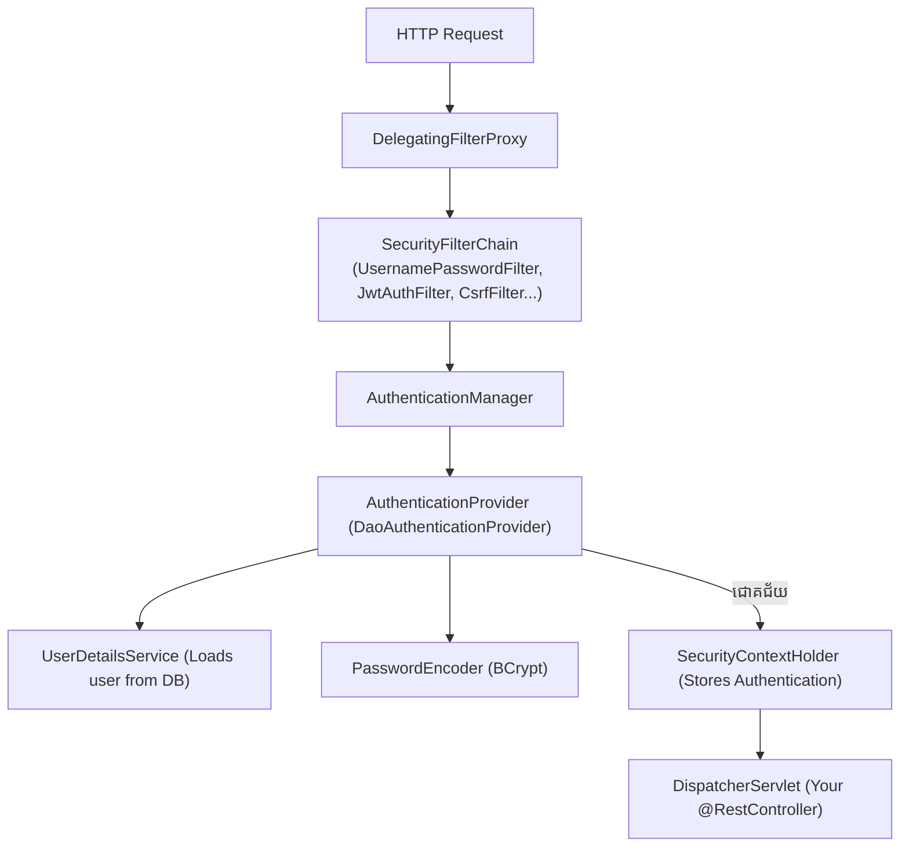
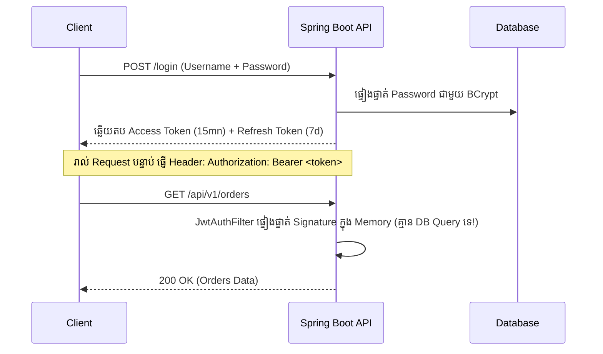
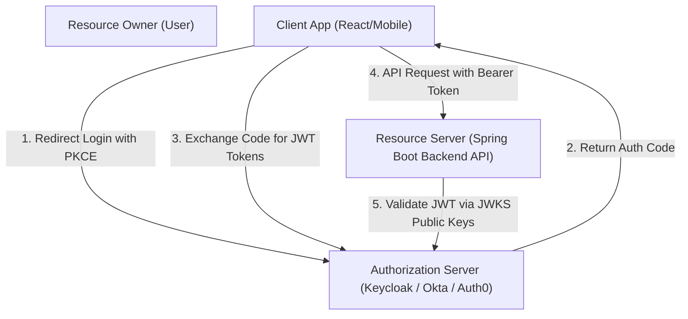

# Module 09: Spring Security, JWT & OAuth2 (ខេមរភាសា) 🇰🇭

> 🌐 **ភាសា / Language:** 🇰🇭 **[ភាសាខ្មែរ (Khmer)](README.kh.md)** | 🇬🇧 [English](README.md)  
> 🧭 **រុករក:** [← 08. Event-Driven & Kafka](../08-event-driven-architecture-and-kafka/README.kh.md) | [📚 Home](../README.kh.md) | [បន្ទាប់: 10. Automated Testing →](../10-automated-testing-junit-mockito-testcontainers/README.kh.md)

---

## មាតិកា (Table of Contents)

1. [ស្ថាបត្យកម្មខាងក្នុងនៃ Spring Security (SecurityFilterChain)](#១-ស្ថាបត្យកម្មខាងក្នុងនៃ-spring-security)
2. [Stateless REST API Authentication ជាមួយ JWT (JSON Web Token)](#២-stateless-authentication-ជាមួយ-jwt)
3. [ការគ្រប់គ្រង Token Expiration & Refresh Token Rotation ជាមួយ Redis](#៣-refresh-token-rotation)
4. [ស្ថាបត្យកម្ម OAuth 2.0 & OpenID Connect (OIDC) ជាមួយ PKCE](#៤-oauth-20--openid-connect-oidc)
5. [Role-Based Access Control (RBAC) & Method-Level Security](#៥-rbac--method-level-security)
6. [CORS vs CSRF៖ ហេតុអ្វី Stateless REST API អាចបិទ CSRF បាន?](#៦-cors-vs-csrf)
7. [អន្ទាក់អ្នកសម្ភាសន៍ (Interviewer Traps)](#៧-អន្ទាក់អ្នកសម្ភាសន៍-interviewer-traps)

---

## ១. ស្ថាបត្យកម្មខាងក្នុងនៃ Spring Security

Spring Security ដំណើរការដោយពឹងផ្អែកលើ **FilterChain Proxy** ដែលស្ទាក់ចាប់រាល់ HTTP Requests ទាំងអស់មុនពេលទៅដល់ `DispatcherServlet`៖



### Spring Security 6+ Configuration (Lambda DSL):
```java
@Configuration
@EnableWebSecurity
@EnableMethodSecurity
public class SecurityConfig {

    @Bean
    public SecurityFilterChain securityFilterChain(HttpSecurity http, JwtAuthenticationFilter jwtAuthFilter) throws Exception {
        return http
            .csrf(AbstractHttpConfigurer::disable) // បិទ CSRF សម្រាប់ Stateless API
            .sessionManagement(session -> session.sessionCreationPolicy(SessionCreationPolicy.STATELESS))
            .authorizeHttpRequests(auth -> auth
                .requestMatchers("/api/v1/auth/**").permitAll() // Public login/register
                .requestMatchers("/api/v1/admin/**").hasRole("ADMIN")
                .anyRequest().authenticated()
            )
            .addFilterBefore(jwtAuthFilter, UsernamePasswordAuthenticationFilter.class)
            .build();
    }
}
```

---

## ២. Stateless Authentication ជាមួយ JWT

JWT បំបែកជា **៣ ផ្នែក** ខណ្ឌដោយសញ្ញាចុច (`header.payload.signature`):
- **Header:** ក្បួន Encryption Algorithm (ឧ. `HS256` ឬ `RS256`)
- **Payload (Claims):** `sub` (User ID), `roles`, `iat` (Issued At), `exp` (Expiration)
- **Signature:** ហត្ថលេខាឌីជីថលដែលចុះដោយ Secret Key ការពារកុំឱ្យ Hacker កែទិន្នន័យបាន។



---

## ៣. Refresh Token Rotation ជាមួយ Redis

- **Access Token:** មានអាយុកាលខ្លី (**15 នាទី**) សម្រាប់ហៅ API។ បើធ្លាក់ក្នុងដៃ Hacker ក៏ខូចខាតត្រឹមតែ ១៥ នាទីប៉ុណ្ណោះ។
- **Refresh Token:** មានអាយុកាលវែង (**៧ ថ្ងៃ ទៅ ៣០ ថ្ងៃ**) រក្សាទុកក្នុង **Redis**។
- **Token Rotation:** រាល់ពេល Client យក Refresh Token មកដូរយក Access Token ថ្មី ប្រព័ន្ធនឹង **លុបចោល Refresh Token ចាស់ ហើយចេញ Refresh Token ថ្មីមួយទៀតជានិច្ច**។ ប្រសិនបើ Hacker លួចយក Token ចាស់មកប្រើ Redis នឹងដឹងភ្លាម រួចធ្វើការ Revoke Session ទាំងអស់របស់ User នោះភ្លាមៗ!

---

## ៤. OAuth 2.0 & OpenID Connect (OIDC)

- **OAuth 2.0:** ពិធីការសម្រាប់ **Authorization (ការផ្តល់សិទ្ធិ)** ដូចជា "អនុញ្ញាតឱ្យ App នេះចូលមើល Google Drive របស់អ្នក"។
- **OpenID Connect (OIDC):** បន្ថែមស្រទាប់ **Authentication (ការផ្ទៀងផ្ទាត់អត្តសញ្ញាណ)** លើ OAuth 2.0 ដោយផ្តល់នូវ `id_token` (JWT) បញ្ជាក់ថា "តើអ្នកជាអ្នកណា?"។



---

## ៥. Method-Level Security

ប្រើប្រាស់ Annotation នៅលើ Service Methods ដើម្បីការពារសិទ្ធិចូលមើល៖

```java
@Service
public class OrderService {

    // ពិនិត្យ Role មុនពេលអនុញ្ញាតឱ្យ Method ដំណើរការ
    @PreAuthorize("hasRole('ADMIN') or #userId == authentication.principal.id")
    public OrderResponse getOrderDetails(Long orderId, Long userId) {
        return orderRepository.findOrder(orderId);
    }
}
```

---

## ៦. CORS vs CSRF

- **CORS (Cross-Origin Resource Sharing):** យន្តការសុវត្ថិភាពរបស់ Browser ដែលទប់ស្កាត់ Frontend (ឧ. `http://localhost:3000`) មិនឱ្យហៅ Backend (`http://api.domain.com`) បើគ្មានការអនុញ្ញាតតាមរយៈ Headers (`Access-Control-Allow-Origin`)។
- **CSRF (Cross-Site Request Forgery):** ការបន្លំសំណើតាមរយៈ Browser Cookies។  
  > **សំណួរសម្ភាសន៍៖** *ហេតុអ្វីបានជាយើងបិទ `csrf.disable()` ក្នុង Spring Boot REST API?*  
  > **ចម្លើយ៖** ពីព្រោះ REST API របស់យើងជា **Stateless** ដោយផ្ញើ Token តាមរយៈ **HTTP Header `Authorization: Bearer <token>`** (មិនមែនប្រើ Session Cookies ដែល Browser ផ្ញើស្វ័យប្រវត្តិនោះទេ) ដូច្នេះការវាយប្រហារ CSRF មិនអាចកើតឡើងបានឡើយ!

---

## ៧. អន្ទាក់អ្នកសម្ភាសន៍ (Interviewer Traps)

> **💡 សំណួរសម្ភាសន៍កម្រិត Senior៖**  
> *"តើយើងអាច Logout ឬទប់ស្កាត់ JWT Token មិនឱ្យប្រើប្រាស់ភ្លាមៗ មុនពេលវា Expire តាមរបៀបណា បើ JWT ជា Stateless?"*  
> **ចម្លើយត្រូវ៖**  
> ដោយសារ JWT ជា Stateless, API មិនសួរ Database រាល់ពេល Check Token ទេ ដូច្នេះតាមធម្មជាតិវាមិនអាច Revoke មុន Expire ឡើយ។  
> **ដំណោះស្រាយស្តង់ដារ Enterprise៖** ប្រើប្រាស់ **Redis Token Blacklist**៖  
> នៅពេល User ចុច Logout យើងយក `jti` (JWT Token ID) ទៅរក្សាទុកក្នុង Redis ជាមួយ Time-To-Live (TTL) ស្មើនឹងរយៈពេលដែលនៅសល់នៃ Token នោះ។ នៅក្នុង `JwtAuthFilter` មុននឹងអនុញ្ញាត យើងឆែកមើលក្នុង Redis មួយភ្លែត — បើមានក្នុង Blacklist យើងបោះ `401 Unauthorized` ភ្លាម!
