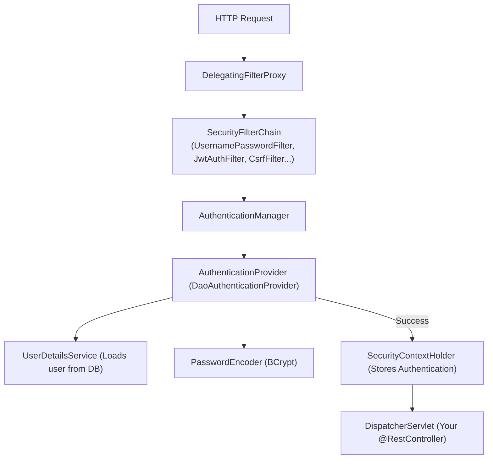
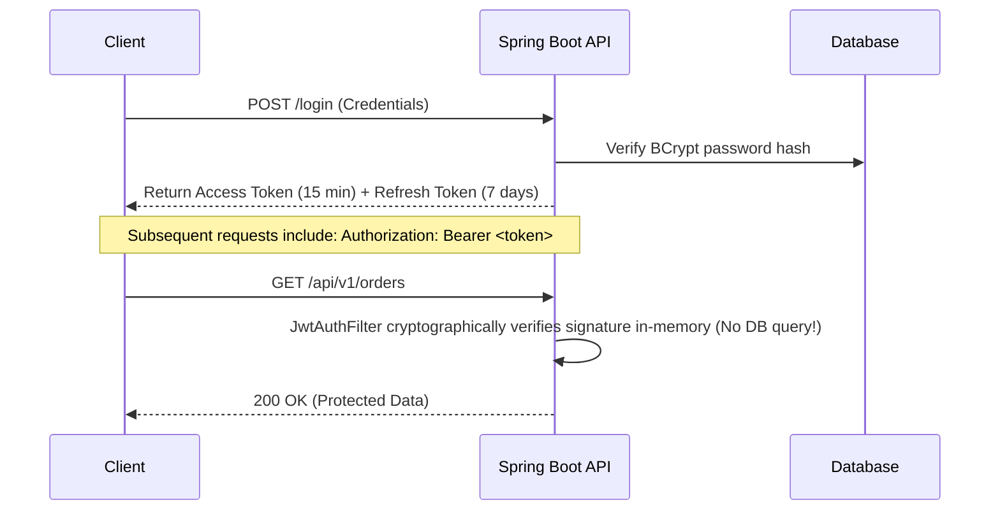
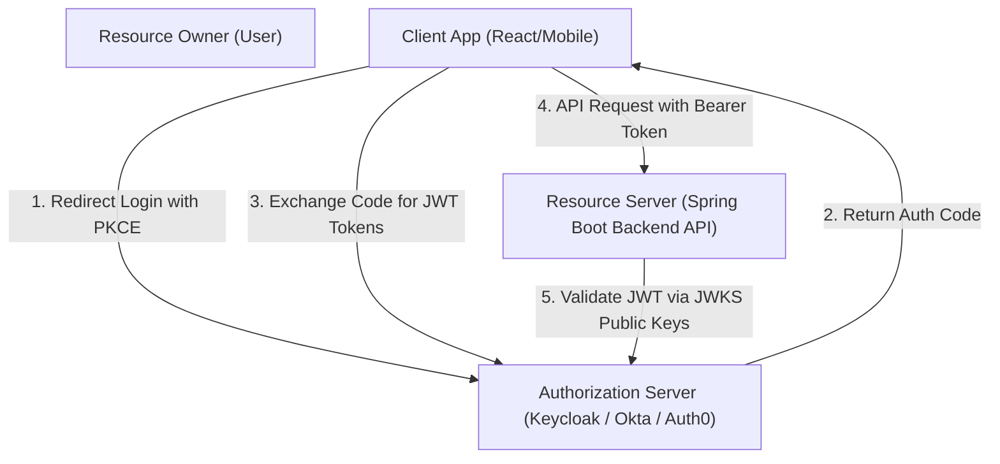

# Module 09: Spring Security, JWT & OAuth2

> 🌐 **Language / ភាសា:** 🇬🇧 **[English](README.md)** | 🇰🇭 [ភាសាខ្មែរ (Khmer)](README.kh.md)  
> 🧭 **Navigation:** [← 08. Event-Driven & Kafka](../08-event-driven-architecture-and-kafka/README.md) | [📚 Home](../README.md) | [Next: 10. Automated Testing →](../10-automated-testing-junit-mockito-testcontainers/README.md)

---

## Table of Contents

1. [Spring Security Internal Architecture (SecurityFilterChain)](#1-spring-security-internal-architecture)
2. [Stateless REST API Authentication with JWT](#2-stateless-rest-api-authentication-with-jwt)
3. [Token Expiration & Refresh Token Rotation with Redis](#3-token-expiration--refresh-token-rotation-with-redis)
4. [OAuth 2.0 & OpenID Connect (OIDC) with PKCE Flow](#4-oauth-20--openid-connect-oidc)
5. [Role-Based Access Control (RBAC) & Method-Level Security](#5-role-based-access-control-rbac)
6. [CORS vs CSRF: Why Stateless APIs Safely Disable CSRF](#6-cors-vs-csrf)
7. [Interviewer Traps: Real-Time JWT Revocation / Blacklisting](#7-interviewer-traps-jwt-revocation)

---

## 1. Spring Security Internal Architecture

Spring Security intercepts inbound HTTP requests via the **`FilterChainProxy`** before reaching the MVC `DispatcherServlet`:



### Spring Security 6+ Configuration:
```java
@Configuration
@EnableWebSecurity
@EnableMethodSecurity
public class SecurityConfig {

    @Bean
    public SecurityFilterChain securityFilterChain(HttpSecurity http, JwtAuthenticationFilter jwtAuthFilter) throws Exception {
        return http
            .csrf(AbstractHttpConfigurer::disable)
            .sessionManagement(session -> session.sessionCreationPolicy(SessionCreationPolicy.STATELESS))
            .authorizeHttpRequests(auth -> auth
                .requestMatchers("/api/v1/auth/**").permitAll()
                .requestMatchers("/api/v1/admin/**").hasRole("ADMIN")
                .anyRequest().authenticated()
            )
            .addFilterBefore(jwtAuthFilter, UsernamePasswordAuthenticationFilter.class)
            .build();
    }
}
```

---

## 2. Stateless REST API Authentication with JWT

A JSON Web Token consists of three base64url-encoded parts (`header.payload.signature`):
- **Header:** Algorithm and token type (`HS256`, `RS256`).
- **Payload:** Claims including identity (`sub`), granted authorities (`roles`), and timestamps (`exp`, `iat`).
- **Signature:** Cryptographic checksum verified with private/public keys.



---

## 3. Refresh Token Rotation with Redis

- **Access Token:** Short lifespan (**15 minutes**); minimizes exposure window.
- **Refresh Token:** Long lifespan (**7-30 days**); stored in Redis.
- **Rotation Rule:** When exchanging a refresh token for a new access token, the auth server invalidates the used refresh token and issues a new pair. If an already-used refresh token is presented, all user sessions are immediately revoked (breach detection).

---

## 4. OAuth 2.0 & OpenID Connect (OIDC)

- **OAuth 2.0:** Delegated **Authorization** standard.
- **OpenID Connect (OIDC):** Identity and **Authentication** layer atop OAuth 2.0 providing standardized ID tokens.



---

## 5. Role-Based Access Control (RBAC)

```java
@Service
public class OrderService {

    @PreAuthorize("hasRole('ADMIN') or #userId == authentication.principal.id")
    public OrderResponse getOrderDetails(Long orderId, Long userId) {
        return orderRepository.findOrder(orderId);
    }
}
```

---

## 6. CORS vs CSRF

- **CORS:** Browser policy restricting cross-origin HTTP requests unless approved by response headers (`Access-Control-Allow-Origin`).
- **CSRF:** Exploits automatic browser credential transmission (cookies). Because modern REST APIs authenticate via the HTTP `Authorization: Bearer <token>` header rather than implicit browser session cookies, CSRF protection is safely disabled (`csrf.disable()`).

---

## 7. Interviewer Traps: JWT Revocation

> **💡 Senior Technical Interview Question:**  
> *"How do you invalidate a stateless JWT before its expiration date when a user logs out?"*  
> **Accurate Response:**  
> By definition, a stateless token cannot be invalidated server-side without introducing state. The enterprise-standard solution is a **Redis Distributed Blacklist**:  
> Upon logout, the token's unique ID (`jti`) is added to Redis with a TTL matching the token's remaining lifespan. The `JwtAuthenticationFilter` checks Redis before permitting the request. Because lookup is done in-memory via Redis O(1), latency impact remains negligible.
