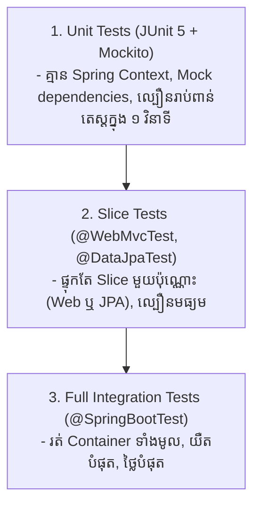

# Module 10: Automated Testing & Testcontainers (ខេមរភាសា) 🇰🇭

> 🌐 **ភាសា / Language:** 🇰🇭 **[ភាសាខ្មែរ (Khmer)](README.kh.md)** | 🇬🇧 [English](README.md)  
> 🧭 **រុករក:** [← 09. Spring Security & JWT](../09-spring-security-jwt-and-oauth2/README.kh.md) | [📚 Home](../README.kh.md) | [បន្ទាប់: 11. DevOps & Observability →](../11-devops-docker-kubernetes-observability/README.kh.md)

---

## មាតិកា (Table of Contents)

1. [ពីរ៉ាមីតនៃការធ្វើតេស្តសូហ្វវែរ (The Testing Pyramid) ក្នុង Spring Boot](#១-ពីរ៉ាមីតនៃការធ្វើតេស្តសូហ្វវែរ)
2. [Unit Testing ជាមួយ JUnit 5 & Mockito (@Mock vs @Spy vs @InjectMocks)](#២-unit-testing-ជាមួយ-junit-5--mockito)
3. [Spring Boot Slice Testing (@WebMvcTest & @DataJpaTest)](#៣-spring-boot-slice-testing)
4. [ហេតុអ្វីបានជាការប្រើ H2 In-Memory Database ក្នុង Test ត្រូវបានចាត់ទុកជា Anti-Pattern?](#៤-ហេតុអ្វី-h2-database-ជា-anti-pattern)
5. [បដិវត្តន៍ Integration Testing ជាមួយ Testcontainers (Real Docker Containers)](#៥-testcontainers)
6. [អន្ទាក់អ្នកសម្ភាសន៍ (Interviewer Traps)](#៦-អន្ទាក់អ្នកសម្ភាសន៍-interviewer-traps)

---

## ១. ពីរ៉ាមីតនៃការធ្វើតេស្តសូហ្វវែរ



---

## ២. Unit Testing ជាមួយ JUnit 5 & Mockito

| Annotation | តួនាទី | កន្លែងប្រើប្រាស់ |
| :--- | :--- | :--- |
| **`@Mock`** | បង្កើត Dummy Object សិប្បនិម្មិត (Fake Object) ដែលមិនរត់កូដពិត | ដាក់លើ Dependencies (ឧ. `OrderRepository`) |
| **`@Spy`** | រុំព័ទ្ធ Real Object ពិតប្រាកដ ដោយអាច Stubbing តែ method ណាដែលចង់កែ | ពេលចង់សាកល្បង Real Code តែ Monitor behavior |
| **`@InjectMocks`**| បង្កើត Instance ពិតប្រាកដនៃ Class ដែលត្រូវ Test រួចចាក់បញ្ចូល Mocks | ដាក់លើ Class ដែលត្រូវ Test (ឧ. `OrderService`) |

```java
@ExtendWith(MockitoExtension.class)
class OrderServiceTest {

    @Mock
    private OrderRepository orderRepository;

    @Mock
    private PaymentClient paymentClient;

    @InjectMocks
    private OrderService orderService; // ចាក់បញ្ចូល Mock ទាំងពីរខាងលើស្វ័យប្រវត្តិ

    @Test
    @DisplayName("បង្កើត Order ជោគជ័យនៅពេល Payment ដំណើរការរលូន")
    void shouldCreateOrderSuccessfully() {
        // 1. Arrange (រៀបចំ Mock Behavior)
        OrderRequest request = new OrderRequest(100.0, "USD");
        when(paymentClient.charge(100.0)).thenReturn(new PaymentResult(true));
        when(orderRepository.save(any(Order.class))).thenAnswer(i -> i.getArgument(0));

        // 2. Act (ដំណើរការ Method ពិត)
        OrderResponse response = orderService.createOrder(request);

        // 3. Assert (ផ្ទៀងផ្ទាត់លទ្ធផល)
        assertThat(response.status()).isEqualTo("COMPLETED");
        verify(paymentClient, times(1)).charge(100.0); // ធានាថាបានហៅកាត់លុយតែម្តងគត់
    }
}
```

---

## ៣. Spring Boot Slice Testing

ជំនួសឱ្យការ Load Spring Context ទាំងមូល (`@SpringBootTest` ដែលស៊ីពេលយូរ) យើងប្រើ **Slice Testing**៖

### ក. `@WebMvcTest` (សម្រាប់ Controller Layer):
```java
@WebMvcTest(OrderController.class)
class OrderControllerTest {

    @Autowired
    private MockMvc mockMvc;

    @MockBean
    private OrderService orderService; // Mock Service layer

    @Test
    void shouldReturn200AndOrderDetails() throws Exception {
        when(orderService.getOrder(1L)).thenReturn(new OrderResponse(1L, "COMPLETED"));

        mockMvc.perform(get("/api/v1/orders/1")
                .contentType(MediaType.APPLICATION_JSON))
                .andExpect(status().isOk())
                .andExpect(jsonPath("$.id").value(1L))
                .andExpect(jsonPath("$.status").value("COMPLETED"));
    }
}
```

---

## ៤. ហេតុអ្វី H2 Database ជា Anti-Pattern?

> **💡 សំណួរសម្ភាសន៍កម្រិត Senior៖**  
> *"ហេតុអ្វីបានជាក្រុមហ៊ុនធំៗលែងប្រើប្រាស់ H2 In-Memory Database សម្រាប់ការធ្វើ Integration Tests ទៀតហើយ?"*

1. **SQL Dialect ខុសគ្នា៖** H2 មិនមានមុខងារដូច PostgreSQL ឬ MySQL ១០០% ទេ (ឧ. JSONB functions, Window functions, Locking semantics)។
2. **False Positives:** កូដ Test ដើរយ៉ាងរលូនលើ H2 ប៉ុន្តែពេល Deploy ទៅ Production បែរជាបែកបាក់ (Broken) លើ Real PostgreSQL!

---

## ៥. បដិវត្តន៍ Integration Testing ជាមួយ Testcontainers

**Testcontainers** គឺជា Java Library ដែលបញ្ជាឱ្យ Docker ទាញយក និងរត់ **Real PostgreSQL, Kafka, ឬ Redis Container** ពិតប្រាកដក្នុងពេល Run Test ហើយកម្ទេចវាចោលវិញពេល Test ចប់៖

```java
@SpringBootTest(webEnvironment = SpringBootTest.WebEnvironment.RANDOM_PORT)
@Testcontainers
class OrderIntegrationTest {

    // បញ្ជាឱ្យ Docker ទាញយក PostgreSQL 16 ផ្លូវការមកបង្កើតជា Container
    @Container
    @ServiceConnection
    static PostgreSQLContainer<?> postgres = new PostgreSQLContainer<>("postgres:16-alpine");

    @Autowired
    private OrderRepository orderRepository;

    @Test
    void shouldPersistOrderInRealPostgres() {
        Order order = new Order("Dara", BigDecimal.valueOf(250.0));
        Order saved = orderRepository.save(order);

        assertThat(saved.getId()).isNotNull();
        // រត់លើ PostgreSQL ពិតប្រាកដ ១០០% ដូច Production!
    }
}
```

---

## ៦. អន្ទាក់អ្នកសម្ភាសន៍ (Interviewer Traps)

> **💡 សំណួរសម្ភាសន៍៖**  
> *"ហេតុអ្វីការដាក់ `@Transactional` លើ Integration Test Method អាចនាំឱ្យមានការយល់ច្រឡំ (False Confidence)?"*  
> **ចម្លើយត្រូវ៖**  
> នៅក្នុង Spring Test, ប្រសិនបើយើងដាក់ `@Transactional` លើ Test Method, Spring នឹង **Rollback Transaction នោះចោលវិញដោយស្វ័យប្រវត្តិ** នៅពេល Method តេស្តនោះចប់ (ដើម្បីកុំឱ្យកខ្វក់ DB)។  
> **គ្រោះថ្នាក់៖** ដោយសារតែវា Rollback មុនពេល Commit, យន្តការមួយចំនួនរបស់ Hibernate ដូចជា **Database Foreign Key Constraints Check, Flush SQL, និង Trigger Validations អាចនឹងមិនដំណើរការឡើយ**! ធ្វើឱ្យយើងស្មានតែ Test ជោគជ័យ តែធាតុពិតកូដមានបញ្ហាពេល Commit ពិតប្រាកដ!
