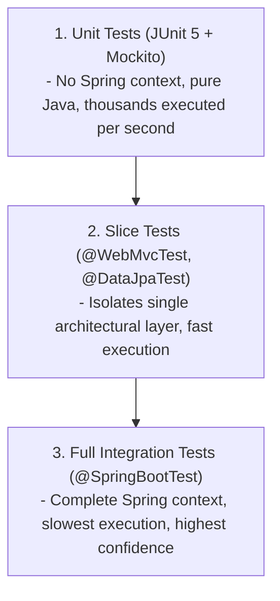

# Module 10: Automated Testing & Testcontainers

> 🌐 **Language / ភាសា:** 🇬🇧 **[English](README.md)** | 🇰🇭 [ភាសាខ្មែរ (Khmer)](README.kh.md)  
> 🧭 **Navigation:** [← 09. Spring Security & JWT](../09-spring-security-jwt-and-oauth2/README.md) | [📚 Home](../README.md) | [Next: 11. DevOps & Observability →](../11-devops-docker-kubernetes-observability/README.md)

---

## Table of Contents

1. [The Testing Pyramid in Spring Boot Applications](#1-the-testing-pyramid-in-spring-boot-applications)
2. [Unit Testing with JUnit 5 & Mockito (@Mock vs @Spy vs @InjectMocks)](#2-unit-testing-with-junit-5--mockito)
3. [Spring Boot Slice Testing (@WebMvcTest & @DataJpaTest)](#3-spring-boot-slice-testing)
4. [Why In-Memory H2 is an Anti-Pattern for Integration Testing](#4-why-in-memory-h2-is-an-anti-pattern)
5. [Production-Grade Integration Testing with Testcontainers](#5-production-grade-integration-testing-with-testcontainers)
6. [Interviewer Traps: The @Transactional Test Rollback Illusion](#6-interviewer-traps-transactional-test-rollback)

---

## 1. The Testing Pyramid in Spring Boot Applications



---

## 2. Unit Testing with JUnit 5 & Mockito

| Annotation | Behavior | Application |
| :--- | :--- | :--- |
| **`@Mock`** | Creates an empty mock instance where invocations return null/default primitives | Injected into dependencies (e.g. `OrderRepository`) |
| **`@Spy`** | Wraps a real object instance, allowing selective method stubbing | Inspecting or partially stubbing real services |
| **`@InjectMocks`**| Instantiates the subject under test and injects mocks into its fields/constructors | Target class under test (e.g. `OrderService`) |

```java
@ExtendWith(MockitoExtension.class)
class OrderServiceTest {

    @Mock
    private OrderRepository orderRepository;

    @Mock
    private PaymentClient paymentClient;

    @InjectMocks
    private OrderService orderService;

    @Test
    @DisplayName("Should successfully place order when payment succeeds")
    void shouldCreateOrderSuccessfully() {
        OrderRequest request = new OrderRequest(100.0, "USD");
        when(paymentClient.charge(100.0)).thenReturn(new PaymentResult(true));
        when(orderRepository.save(any(Order.class))).thenAnswer(invocation -> invocation.getArgument(0));

        OrderResponse response = orderService.createOrder(request);

        assertThat(response.status()).isEqualTo("COMPLETED");
        verify(paymentClient, times(1)).charge(100.0);
    }
}
```

---

## 3. Spring Boot Slice Testing

Test only the web presentation layer without bootstrapping persistent database contexts:

```java
@WebMvcTest(OrderController.class)
class OrderControllerTest {

    @Autowired
    private MockMvc mockMvc;

    @MockBean
    private OrderService orderService;

    @Test
    void shouldReturn200AndOrderDetails() throws Exception {
        when(orderService.getOrder(1L)).thenReturn(new OrderResponse(1L, "COMPLETED"));

        mockMvc.perform(get("/api/v1/orders/1")
                .contentType(MediaType.APPLICATION_JSON))
                .andExpect(status().isOk())
                .andExpect(jsonPath("$.id").value(1L))
                .andExpect(jsonPath("$.status").value("COMPLETED"));
    }
}
```

---

## 4. Why In-Memory H2 is an Anti-Pattern

1. **Dialect Divergence:** H2 behaves differently from PostgreSQL, MySQL, and Oracle regarding JSON operators, full-text indexes, and isolation locks.
2. **False Confidence:** Tests pass against H2 but fail in production staging environments due to schema or constraint incompatibilities.

---

## 5. Production-Grade Integration Testing with Testcontainers

Testcontainers orchestrates ephemeral Docker containers directly from Java test runners:

```java
@SpringBootTest(webEnvironment = SpringBootTest.WebEnvironment.RANDOM_PORT)
@Testcontainers
class OrderIntegrationTest {

    @Container
    @ServiceConnection
    static PostgreSQLContainer<?> postgres = new PostgreSQLContainer<>("postgres:16-alpine");

    @Autowired
    private OrderRepository orderRepository;

    @Test
    void shouldPersistOrderInRealPostgres() {
        Order order = new Order("Dara", BigDecimal.valueOf(250.0));
        Order saved = orderRepository.save(order);

        assertThat(saved.getId()).isNotNull();
    }
}
```

---

## 6. Interviewer Traps: @Transactional Test Rollback

> **💡 Senior Interview Question:**  
> *"What hidden hazard exists when annotating integration test methods with `@Transactional`?"*  
> **Accurate Response:**  
> In test contexts, `@Transactional` automatically rolls back the transaction at the end of the test method to preserve database cleanliness.  
> **The Hazard:** Because the transaction is rolled back before an actual physical commit occurs, Hibernate flush events and database constraints (foreign keys, check constraints, unique indexes, database triggers) may **never execute during the test**, masking critical schema validation errors!
