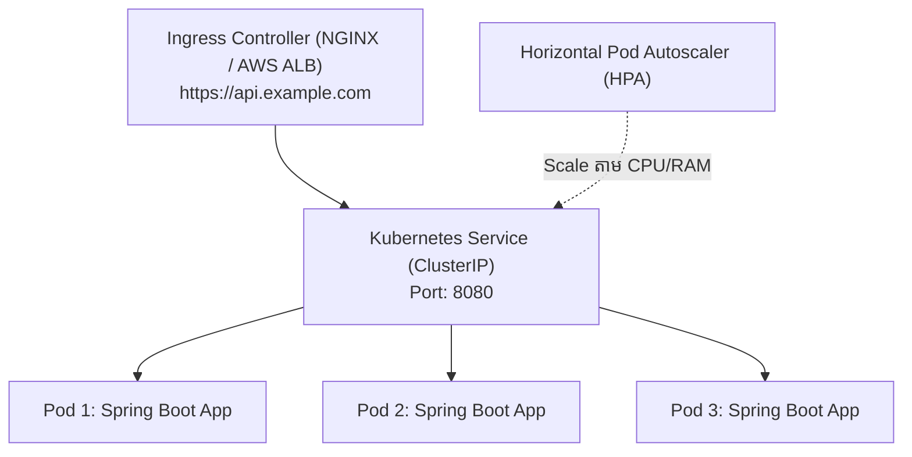
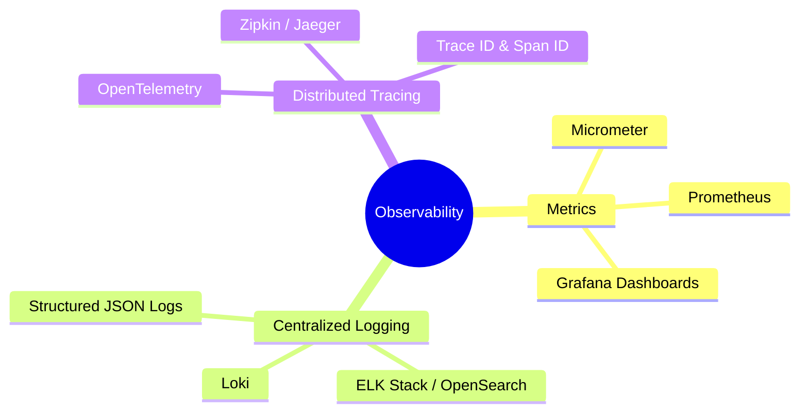

# Module 11: DevOps, Docker, Kubernetes & Observability (ខេមរភាសា) 🇰🇭

> 🌐 **ភាសា / Language:** 🇰🇭 **[ភាសាខ្មែរ (Khmer)](README.kh.md)** | 🇬🇧 [English](README.md)  
> 🧭 **រុករក:** [← 10. Automated Testing](../10-automated-testing-junit-mockito-testcontainers/README.kh.md) | [📚 Home](../README.kh.md) | [បន្ទាប់: 12. System Design & Live Coding →](../12-system-design-scenarios-and-live-coding/README.kh.md)

---

## មាតិកា (Table of Contents)

1. [ស្តង់ដារ Production Dockerfile សម្រាប់ Spring Boot (Multi-Stage & Layered JAR)](#១-production-dockerfile)
2. [គំនិតស្នូលនៃ Kubernetes សម្រាប់ Java Developer (Pods, Deployments, Services)](#២-គំនិតស្នូលនៃ-kubernetes)
3. [Kubernetes Liveness & Readiness Probes ជាមួយ Spring Boot Actuator](#៣-kubernetes-liveness--readiness-probes)
4. [Graceful Shutdown៖ ការពារកុំឱ្យដាច់សំណើអតិថិជនពេល Restart/Deploy](#៤-graceful-shutdown)
5. [សសរទ្រូងទាំង ៣ នៃ Observability (Metrics, Logs, Distributed Tracing)](#៥-សសរទ្រូងទាំង-៣-នៃ-observability)
6. [អន្ទាក់អ្នកសម្ភាសន៍ (Interviewer Traps)](#៦-អន្ទាក់អ្នកសម្ភាសន៍-interviewer-traps)

---

## ១. Production Dockerfile

> **💡 សំណួរសម្ភាសន៍៖**  
> *"តើអ្នកសរសេរ Dockerfile យ៉ាងដូចម្តេចដើម្បីឱ្យ Image មានទំហំតូចបំផុត សុវត្ថិភាពខ្ពស់ និង Build បានលឿន?"*

```dockerfile
# Stage 1: Build & Layer Extraction
FROM eclipse-temurin:21-jdk-alpine AS builder
WORKDIR /app
COPY .mvn/ .mvn
COPY mvnw pom.xml ./
RUN ./mvnw dependency:go-offline -B

COPY src ./src
RUN ./mvnw clean package -DskipTests
RUN java -Djarmode=layertools -jar target/*.jar extract

# Stage 2: Minimal & Secure Runtime
FROM eclipse-temurin:21-jre-alpine
WORKDIR /app

# បង្កើត Non-root User ដើម្បីសុវត្ថិភាពខ្ពស់ (ជៀសវាងរត់ជា root)
RUN addgroup -S spring && adduser -S spring -G spring
USER spring:spring

# Copy Layered dependencies (Cache បានល្អឥតខ្ចោះ)
COPY --from=builder /app/dependencies/ ./
COPY --from=builder /app/spring-boot-loader/ ./
COPY --from=builder /app/snapshot-dependencies/ ./
COPY --from=builder /app/application/ ./

EXPOSE 8080
ENTRYPOINT ["java", "org.springframework.boot.loader.launch.JarLauncher"]
```

---

## ២. គំនិតស្នូលនៃ Kubernetes



- **Pod:** ឯកតាតូចបំផុតដែលដំណើរការ Container របស់យើង។
- **Deployment:** គ្រប់គ្រងចំនួន Pods (Replicas) និងការធ្វើ Rolling Updates ដោយគ្មាន Downtime។
- **Service (ClusterIP):** ដើរតួជា Internal Load Balancer ផ្តល់នូវ IP ថេរសម្រាប់ទាក់ទងទៅកាន់ Pods ខាងក្នុង។
- **Ingress:** ច្រកទ្វារ Router ខាងក្រៅដែលគ្រប់គ្រង Domain Name, SSL Certificate, និងបង្វែរផ្លូវទៅកាន់ Service។

---

## ៣. Kubernetes Liveness & Readiness Probes

ដើម្បីឱ្យ Kubernetes ដឹងច្បាស់ពីសុខភាពរបស់ Spring Boot App យើងប្រើប្រាស់ **Actuator Probes**៖

```yaml
# kubernetes-deployment.yml
spec:
  containers:
    - name: order-service
      image: myregistry/order-service:1.0.0
      livenessProbe:
        httpGet:
          path: /actuator/health/liveness
          port: 8080
        initialDelaySeconds: 45
        periodSeconds: 10
      readinessProbe:
        httpGet:
          path: /actuator/health/readiness
          port: 8080
        initialDelaySeconds: 20
        periodSeconds: 5
```

- **Liveness Probe:** ពិនិត្យមើលថាតើ JVM នៅរស់ ឬគាំង (Deadlock)? បើ Probe បរាជ័យ Kubernetes នឹង **Kill Container រួច Restart ឡើងវិញភ្លាមៗ**!
- **Readiness Probe:** ពិនិត្យមើលថាតើ Spring Boot បាន Boot ចប់សព្វគ្រប់ និងភ្ជាប់ទៅ DB រួចរាល់សម្រាប់ទទួល Traffic ឬនៅ? បើ Probe បរាជ័យ Kubernetes នឹង **ផ្អាកការបញ្ជូន Traffic ជាបណ្តោះអាសន្ន** ដោយមិន Restart Pod ឡើយ។

---

## ៤. Graceful Shutdown

ពេល Kubernetes ចង់បិទ Pod ចាស់ដើម្បី Deploy កូដថ្មី ប្រសិនបើមិនកំណត់ Graceful Shutdown ទេ សំណើរបស់ Users ដែលកំពុងកាត់លុយនឹងត្រូវកាត់ផ្តាច់ភ្លាមៗ (`Connection Reset`)៖

```yaml
# application.yml
server:
  shutdown: graceful

spring:
  lifecycle:
    timeout-per-shutdown-phase: 30s
```

នៅពេលទទួលសញ្ញា `SIGTERM` ពី Kubernetes៖
1. Spring Boot នឹងឈប់ទទួលសំណើថ្មីពីខាងក្រៅ។
2. វារង់ចាំសំណើចាស់ៗដែលកំពុងដំណើរការ (In-flight Requests) ឱ្យដំណើរការចប់រហូតដល់អតិបរមា 30 វិនាទី ទើបបិទដំណើរការយ៉ាងរលូន!

---

## ៥. សសរទ្រូងទាំង ៣ នៃ Observability



### Distributed Tracing (Trace ID & Span ID):
នៅពេល Request មួយរត់កាត់ Services ចំនួន ៥ តើយើងដឹងដោយរបៀបណាថា Service មួយណាដែលដើរយឺត?
- **Trace ID:** លេខកូដសម្គាល់តែមួយគត់ដែលបង្កើតឡើងតាំងពីច្រក API Gateway រួចបញ្ជូនបន្តតាម HTTP Headers (W3C Trace Context) កាត់គ្រប់ Services ទាំងអស់។
- **Span ID:** លេខកូដសម្គាល់ជំហាននីមួយៗក្នុង Service នីមួយៗ។

---

## ៦. អន្ទាក់អ្នកសម្ភាសន៍ (Interviewer Traps)

> **💡 សំណួរសម្ភាសន៍៖**  
> *"ហេតុអ្វីបានជា Java App នៅក្នុង Docker Container តែងតែត្រូវ Linux Kernel សម្លាប់ចោល (OOMKilled - Exit Code 137) ទោះបីជាយើងបានកំណត់ Max Heap Memory `-Xmx` រួចហើយក៏ដោយ?"*  
> **ចម្លើយត្រូវ៖**  
> ពីព្រោះ `-Xmx` កំណត់ **តែ Heap Memory ប៉ុណ្ណោះ**! ប៉ុន្តែ JVM ស៊ី Memory លើសពី Heap ឆ្ងាយណាស់ រួមមាន៖
> 1. **Metaspace:** ផ្ទុក Class Metadata
> 2. **Thread Stacks:** រាល់ 1,000 Threads ស៊ីប្រមាណ 1GB ក្រៅ Heap!
> 3. **Garbage Collector Overhead:** រចនាសម្ព័ន្ធទិន្នន័យរបស់ GC
> 4. **Direct / Native Memory (Netty / JVM C++):** ប្រើសម្រាប់ Network Buffers  
> **ដំណោះស្រាយ៖** ត្រូវកំណត់ Container Memory Limit ក្នុង Kubernetes ឱ្យធំជាង `-Xmx` យ៉ាងតិច **25% ទៅ 30%** (ឧ. បើ `-Xmx2g` ត្រូវដាក់ Container Limit `2.6Gi` ឬ `3Gi`)!
