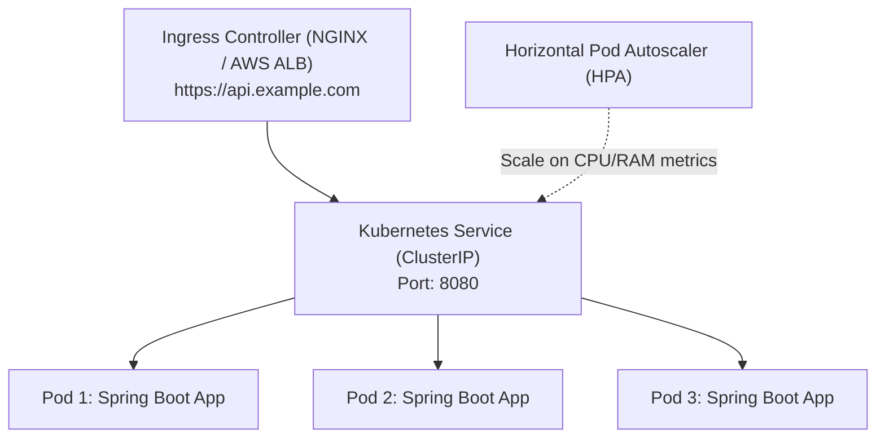
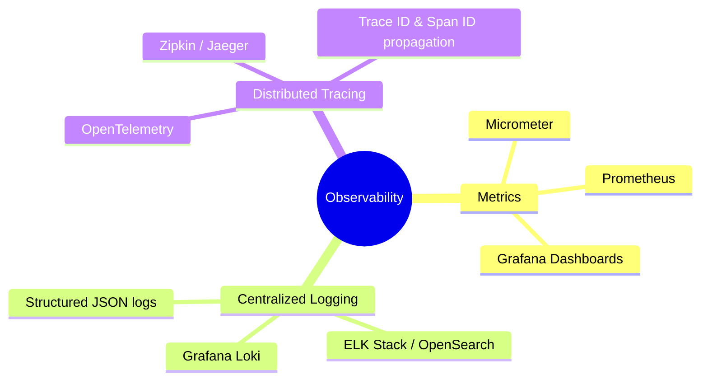

# Module 11: DevOps, Docker, Kubernetes & Observability

> 🌐 **Language / ភាសា:** 🇬🇧 **[English](README.md)** | 🇰🇭 [ភាសាខ្មែរ (Khmer)](README.kh.md)  
> 🧭 **Navigation:** [← 10. Automated Testing](../10-automated-testing-junit-mockito-testcontainers/README.md) | [📚 Home](../README.md) | [Next: 12. System Design & Live Coding →](../12-system-design-scenarios-and-live-coding/README.md)

---

## Table of Contents

1. [Production-Grade Dockerfile for Spring Boot (Multi-Stage & Layered JARs)](#1-production-grade-dockerfile)
2. [Kubernetes Core Concepts for Java Backend Engineers](#2-kubernetes-core-concepts)
3. [Kubernetes Liveness & Readiness Probes with Spring Boot Actuator](#3-kubernetes-liveness--readiness-probes)
4. [Graceful Shutdown Implementation](#4-graceful-shutdown-implementation)
5. [The 3 Pillars of Observability: Metrics, Logs, Distributed Tracing](#5-the-3-pillars-of-observability)
6. [Interviewer Traps: JVM Memory Footprint & Container OOMKilled (Exit 137)](#6-interviewer-traps-container-oomkilled)

---

## 1. Production-Grade Dockerfile

```dockerfile
# Stage 1: Build & Layer Extraction
FROM eclipse-temurin:21-jdk-alpine AS builder
WORKDIR /app
COPY .mvn/ .mvn
COPY mvnw pom.xml ./
RUN ./mvnw dependency:go-offline -B

COPY src ./src
RUN ./mvnw clean package -DskipTests
RUN java -Djarmode=layertools -jar target/*.jar extract

# Stage 2: Minimal & Hardened Runtime Image
FROM eclipse-temurin:21-jre-alpine
WORKDIR /app

# Run as non-root user for security compliance
RUN addgroup -S spring && adduser -S spring -G spring
USER spring:spring

# Copy extracted layers to optimize Docker layer caching
COPY --from=builder /app/dependencies/ ./
COPY --from=builder /app/spring-boot-loader/ ./
COPY --from=builder /app/snapshot-dependencies/ ./
COPY --from=builder /app/application/ ./

EXPOSE 8080
ENTRYPOINT ["java", "org.springframework.boot.loader.launch.JarLauncher"]
```

---

## 2. Kubernetes Core Concepts



- **Pod:** Smallest deployable compute unit hosting the Spring Boot container.
- **Deployment:** Manages replica sets and zero-downtime rolling updates.
- **Service:** Static internal virtual IP load-balancing traffic across matching pods.
- **Ingress:** Manages external HTTPS routing and domain termination.

---

## 3. Kubernetes Liveness & Readiness Probes

```yaml
spec:
  containers:
    - name: order-service
      image: myregistry/order-service:1.0.0
      livenessProbe:
        httpGet:
          path: /actuator/health/liveness
          port: 8080
        initialDelaySeconds: 45
        periodSeconds: 10
      readinessProbe:
        httpGet:
          path: /actuator/health/readiness
          port: 8080
        initialDelaySeconds: 20
        periodSeconds: 5
```

- **Liveness Probe:** Tests JVM health. Failures trigger immediate container restart.
- **Readiness Probe:** Tests availability to process traffic. Failures isolate the pod from the Service endpoint without triggering a restart.

---

## 4. Graceful Shutdown Implementation

```yaml
server:
  shutdown: graceful

spring:
  lifecycle:
    timeout-per-shutdown-phase: 30s
```

Upon receiving a `SIGTERM` signal, Spring Boot halts incoming requests and allows ongoing in-flight HTTP requests up to 30 seconds to complete cleanly.

---

## 5. The 3 Pillars of Observability



---

## 6. Interviewer Traps: Container OOMKilled (Exit Code 137)

> **💡 Senior Technical Interview Question:**  
> *"Why do Java applications in containers frequently crash with Kubernetes OOMKilled (Exit Code 137) even when `-Xmx` is set below the container memory limit?"*  
> **Accurate Response:**  
> `-Xmx` controls **only the heap memory**. The JVM process memory footprint extends significantly beyond heap:  
> 1. **Metaspace:** Class definitions and bytecode.  
> 2. **Thread Stacks:** 1,000 threads consume ~1GB of off-heap memory.  
> 3. **Garbage Collector Data Structures:** G1/ZGC internal mark-card tables.  
> 4. **Direct / Off-heap Buffers:** Used heavily by Netty, NIO, and JDBC drivers.  
> **Remedy:** Always configure the Kubernetes container memory limit **25-30% higher** than `-Xmx` (e.g., set container limit to `2.6Gi` or `3Gi` when `-Xmx` is `2g`).
