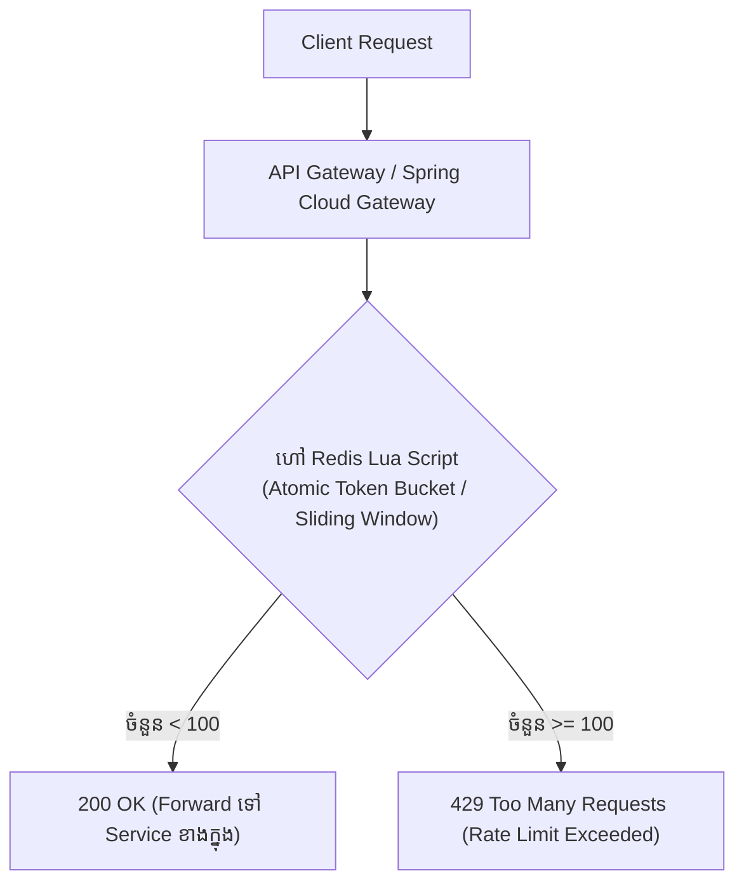
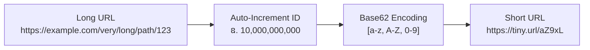
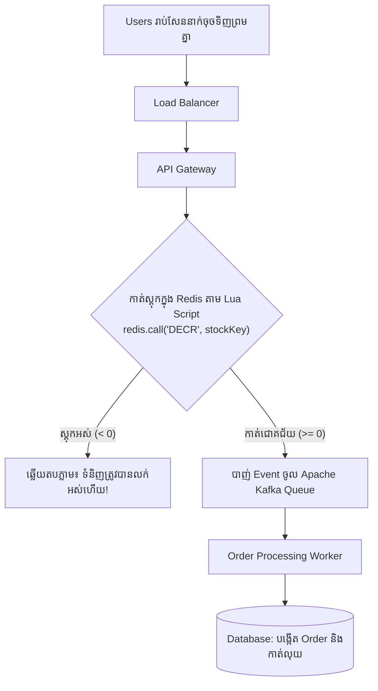
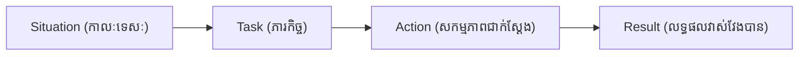

# Module 12: System Design Scenarios, Live Coding & STAR Method (ខេមរភាសា) 🇰🇭

> 🌐 **ភាសា / Language:** 🇰🇭 **[ភាសាខ្មែរ (Khmer)](README.kh.md)** | 🇬🇧 [English](README.md)  
> 🧭 **រុករក:** [← 11. DevOps & Observability](../11-devops-docker-kubernetes-observability/README.kh.md) | [📚 Home](../README.kh.md)

---

## មាតិកា (Table of Contents)

1. [សេណារីយ៉ូ System Design ទី ១៖ ការរចនា Distributed Rate Limiter ជាមួយ Redis Lua Script](#១-ការរចនា-distributed-rate-limiter)
2. [សេណារីយ៉ូ System Design ទី ២៖ ការរចនា URL Shortener (TinyURL) ជាមួយ Base62](#២-ការរចនា-url-shortener)
3. [សេណារីយ៉ូ System Design ទី ៣៖ ការរចនាប្រព័ន្ធទប់ទល់ High Concurrency (Flash Sale & Inventory Reservation)](#៣-ការរចនាប្រព័ន្ធ-flash-sale)
4. [ក្បួនដោះស្រាយ Live Coding ទាំង ៥ ដែលចេញប្រឡងញឹកញាប់បំផុត](#៤-ក្បួនដោះស្រាយ-live-coding-ទាំង-៥)
5. [រូបមន្ត STAR Method សម្រាប់ឆ្លើយសំណួរ Behavioral Interview](#៥-រូបមន្ត-star-method)
6. [ការរៀបចំ CV / Resume តាមស្តង់ដារ ATS សម្រាប់ Java Backend Engineer](#៦-ការរៀបចំ-cv--resume)

---

## ១. ការរចនា Distributed Rate Limiter

> **សំណួរ System Design៖**  
> *"ចូររចនាប្រព័ន្ធ Rate Limiter ដើម្បីកំណត់ឱ្យ User ម្នាក់អាចហៅ API បានអតិបរមា ១០០ ដងក្នុង ១ នាទី។ បើហៅលើសពីនេះ ត្រូវឆ្លើយតប `429 Too Many Requests`។"*

### ហេតុអ្វីត្រូវប្រើ Redis Lua Script?
ដើម្បីការពារ **Race Condition**! បើយើងហៅ Redis GET រួចទើបហៅ SET (២ ជំហានដាច់ដោយឡែក) នៅពេលមាន Requests ចូលមកព្រមគ្នា វាអាចរំលោភលើ Limit បាន។ **Lua Script ដំណើរការជា Atomic តែមួយក្នុង Redis Single-threaded Engine**។

---

## ២. ការរចនា URL Shortener (TinyURL)

1. **ក្បួនដោះស្រាយ Base62:**
   - ប្រើអក្សរតូច (26) + អក្សរធំ (26) + លេខ (10) = 62 តួអក្សរ។
   - ជាមួយនឹង URL ប្រវែង **៧ តួអក្សរ** យើងអាចផ្ទុកបានរហូតដល់ $62^7 \approx 3.5$ ទ្រីលាន URLs!
2. **ស្ថាបត្យកម្ម Caching (Cache-Aside):**
   - ៩៩% នៃចរាចរណ៍គឺជាការ Redirect (Read-heavy) ដូច្នេះយើងដាក់ **Redis Cache** នៅពីមុខ Database។
   - ពេលមាន Request ចូលមក យើងឆែកក្នុង Redis មុន — បើឃើញ យើងឆ្លើយតប `301 Moved Permanently` (ឬ `302 Found` បើចង់រាប់ Metrics)។

---

## ៣. ការរចនាប្រព័ន្ធ Flash Sale (High Concurrency)

បញ្ហាប្រឈមធំបំផុតក្នុងថ្ងៃប្រូម៉ូសិនពិសេស (11.11 Flash Sale) គឺ **Overselling (ការលក់លើសស្តុក)** និង **Database Deadlocks**៖

> **គន្លឹះសំខាន់៖** មិនត្រូវឱ្យ Requests រាប់សែនរត់ទៅបុក Database PostgreSQL ដោយផ្ទាល់ឡើយ! ត្រូវប្រើ **Redis Memory Decr** ជាខែលការពារខាងក្រៅ រួចប្រើ **Kafka Asynchronous Queue** ដើម្បីសម្រួលបន្ទុក Database ខាងក្នុង។

---

## ៤. ក្បួនដោះស្រាយ Live Coding ទាំង ៥

1. **Two Pointers (ចង្អុលពីរ):** ប្រើសម្រាប់ស្វែងរកគូក្នុង Sorted Array (ឧ. Two Sum, Container With Most Water)។
2. **Sliding Window (បង្អួចរំកិល):** ប្រើសម្រាប់ Subarray / Substring (ឧ. Longest Substring Without Repeating Characters)។
3. **Fast & Slow Pointers (ក្បួនអណ្តើក និងទន្សាយ):** ស្វែងរក Cycle ក្នុង LinkedList ឬរកចំនុចកណ្តាលនៃ Node។
4. **Top K Elements (PriorityQueue / Min-Heap):** ស្វែងរកធាតុធំជាងគេទាំង K (Kth Largest Element) ដោយចំណាយ Time Complexity $O(N \log K)$។
5. **Breadth-First Search (BFS) & Depth-First Search (DFS):** ដើរលើ Tree, Graph, និង Matrix។

---

## ៥. រូបមន្ត STAR Method សម្រាប់ Behavioral Interview

នៅពេលអ្នកសម្ភាសន៍សួរ៖  
*"ចូររៀបរាប់ពីពេលដែលអ្នកជួបប្រទះបញ្ហា Outage ធ្ងន់ធ្ងរក្នុង Production ហើយតើអ្នកដោះស្រាយវាដោយរបៀបណា?"*

សូមអនុវត្តតាមរូបមន្ត **STAR**៖

- **S (Situation):** *"កាលពីឆ្នាំមុន ក្នុងថ្ងៃបើកប្រាក់ខែ ប្រព័ន្ធទូទាត់ប្រាក់ Core Payment របស់យើងបានធ្លាក់ល្បឿនយ៉ាងខ្លាំង ហើយ Response Time កើនឡើងដល់ 10 វិនាទី បណ្តាលឱ្យ Transactions ជាច្រើន Timeout។"*
- **T (Task):** *"ក្នុងនាមជា Backend Engineer ខ្ញុំត្រូវស្វែងរកឫសគល់នៃបញ្ហា និងស្រោចស្រង់ប្រព័ន្ធឱ្យដំណើរការធម្មតាវិញក្នុងរយៈពេលក្រោម 30 នាទី។"*
- **A (Action):** *"ខ្ញុំបានបើកមើល Grafana Metrics និងទាញយក Thread Dump តាមរយៈ `jcmd`។ ខ្ញុំបានរកឃើញថា Connection Pool (HikariCP) ពេញ ១០០% ដោយសារតែមាន Query មួយខ្វះ Index និងដំណើរការក្នុង `@Transactional` វែងអន្លាយ។ ខ្ញុំបាន Kill Slow Queries នោះ បង្កើន Connection Pool ជាបណ្តោះអាសន្ន រួចបង្កើត Index បន្ទាន់ និងកែប្រែកូដឱ្យប្រើ Read-only Transaction។"*
- **R (Result):** *"ប្រព័ន្ធបានវិលមករកប្រក្រតីភាពក្នុងរយៈពេល 18 នាទី, Response Time ធ្លាក់មកក្រោម 150ms វិញ ហើយបន្ទាប់មកខ្ញុំបានសរសេរ Post-mortem Report និងបន្ថែម Alerting rules ក្នុង Prometheus ដើម្បីការពារកុំឱ្យកើតមានម្តងទៀត។"*

---

## ៦. ការរៀបចំ CV / Resume តាមស្តង់ដារ ATS

- **កុំគ្រាន់តែរៀបរាប់ឈ្មោះបច្ចេកវិទ្យា (Buzzwords):** ជំនួសឱ្យការសរសេរថា *"Used Spring Boot and Kafka"*, ចូរសរសេរជា **ផលជះជាក់ស្តែង (Impact Metrics)**៖
  - *"រចនា និងសាងសង់ប្រព័ន្ធ Notification Service ដោយប្រើ Spring Boot និង Apache Kafka ដែលអាចទ្រទ្រង់ការបញ្ជូនសារជាង 500,000 សារក្នុងមួយថ្ងៃ ជាមួយនឹង Latency ក្រោម 200ms។"*
  - *"កែលម្អ SQL Queries និង Database Indexing ដោយដោះស្រាយបញ្ហា N+1 Query Problem ជួយកាត់បន្ថយបន្ទុក CPU លើ PostgreSQL បាន 40%។"*
