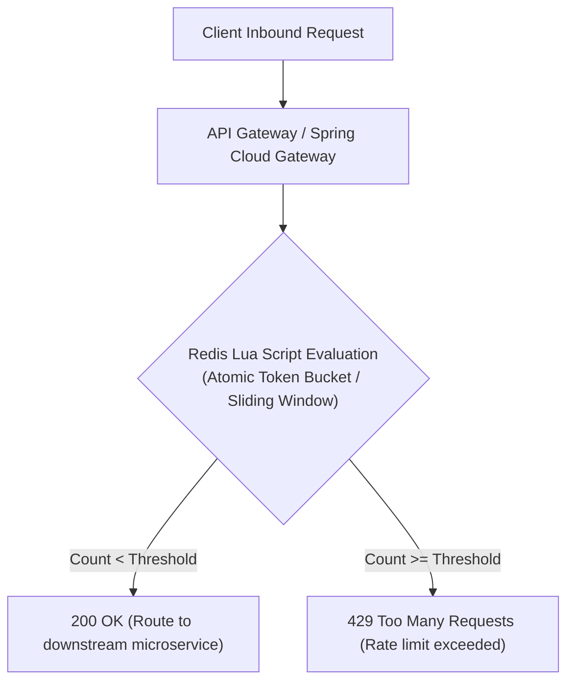
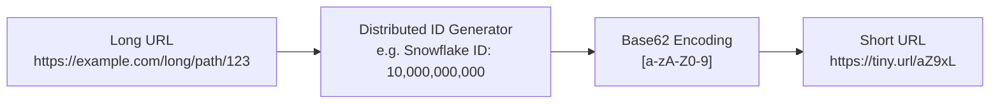
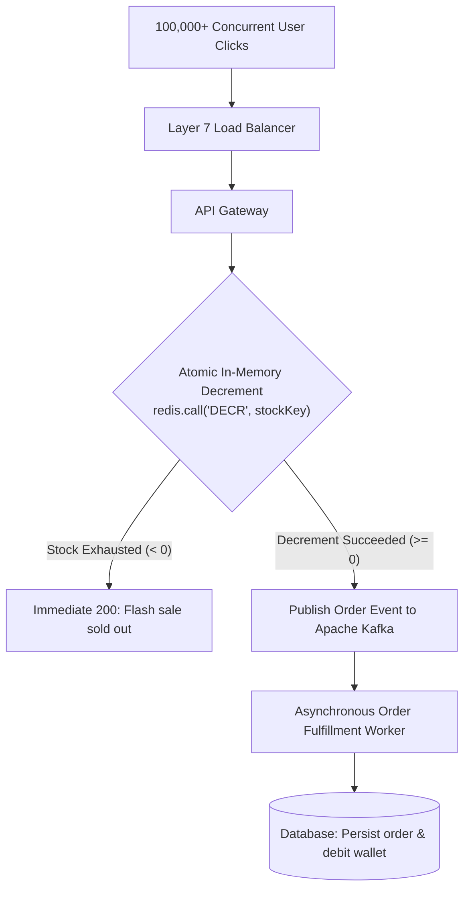
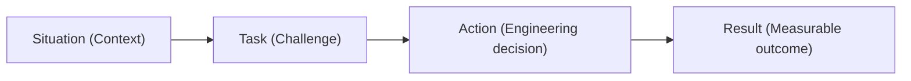

# Module 12: System Design Scenarios, Live Coding & Behavioral STAR Method

> 🌐 **Language / ភាសា:** 🇬🇧 **[English](README.md)** | 🇰🇭 [ភាសាខ្មែរ (Khmer)](README.kh.md)  
> 🧭 **Navigation:** [← 11. DevOps & Observability](../11-devops-docker-kubernetes-observability/README.md) | [📚 Home](../README.md)

---

## Table of Contents

1. [System Design Scenario 1: Distributed Rate Limiter with Redis Lua Scripts](#1-distributed-rate-limiter)
2. [System Design Scenario 2: Scalable URL Shortener (TinyURL) with Base62](#2-url-shortener)
3. [System Design Scenario 3: High-Concurrency Flash Sale & Inventory Reservation](#3-flash-sale-inventory-reservation)
4. [Top 5 Live Coding Patterns for Java Backend Engineers](#4-top-5-live-coding-patterns)
5. [The STAR Method for Behavioral Interviews](#5-the-star-method)
6. [ATS-Optimized Resume Strategies for Java Backend Developers](#6-ats-optimized-resume-strategies)

---

## 1. Distributed Rate Limiter

### Why Redis Lua Scripts are Mandatory:
To eliminate concurrency race conditions. Separating the read (`GET`) from write (`INCR`/`SET`) creates windows where concurrent threads exceed the rate threshold. **Lua scripts execute atomically within Redis's single-threaded event loop**.

---

## 2. URL Shortener (TinyURL)

1. **Base62 Character Space:** $[a-z, A-Z, 0-9] = 62$ characters. A 7-character string generates $62^7 \approx 3.5 \text{ trillion}$ unique short URLs.
2. **Caching Strategy (Cache-Aside):** Over 99% of requests are redirections (Read-heavy). Short URLs are cached in **Redis**; cache misses query PostgreSQL and populate Redis with a TTL before redirecting (`301 Moved Permanently` or `302 Found`).

---

## 3. Flash Sale & Inventory Reservation

Preventing overselling and database lock contention under massive traffic spikes:

> **Design Principle:** Never expose persistent databases directly to massive concurrency bursts. Protect the persistence layer with **in-memory atomic decrements (Redis)** and absorb write traffic via **message queues (Kafka)**.

---

## 4. Top 5 Live Coding Patterns

1. **Two Pointers:** Optimal for sorted collections (e.g., Two Sum II, Container With Most Water).
2. **Sliding Window:** Subarray and substring optimization (e.g., Longest Substring Without Repeating Characters).
3. **Fast & Slow Pointers:** Cycle detection in linked data structures (Floyd's Tortoise and Hare).
4. **Top K Elements:** PriorityQueue (Min-Heap/Max-Heap) for $O(N \log K)$ selection without sorting the full array.
5. **Breadth-First Search (BFS) & Depth-First Search (DFS):** Traversal of graphs, matrix coordinates, and hierarchical trees.

---

## 5. The STAR Method

- **Situation:** *"During end-of-month payroll processing, our core transactional payment service experienced latency spikes exceeding 10 seconds, causing upstream checkout timeouts."*
- **Task:** *"As backend engineer, I needed to identify the root cause and restore operational latency below 200ms within a 30-minute SLA."*
- **Action:** *"I inspected Prometheus connection metrics and pulled a thread dump via `jcmd`. I identified HikariCP connection pool exhaustion triggered by an unindexed query wrapped in an overly broad `@Transactional` method. I terminated the hung queries, dynamically expanded the connection pool, deployed a composite index hotfix, and restructured the code into read-only transactions."*
- **Result:** *"Normal operations were restored within 18 minutes, p99 latency dropped to 120ms, and I implemented an automated alerting rule to prevent unindexed table queries from reaching production."*

---

## 6. ATS-Optimized Resume Strategies

Avoid generic buzzword lists. Always frame experience with **measurable engineering impact**:
- *"Designed and deployed an event-driven notification microservice using Spring Boot and Apache Kafka, handling over 500,000 daily messages with p99 latency under 150ms."*
- *"Resolved the N+1 Hibernate query problem across order persistence modules using JOIN FETCH and Entity Graphs, reducing PostgreSQL CPU utilization by 40%."*
