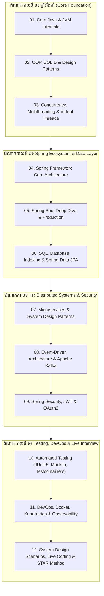
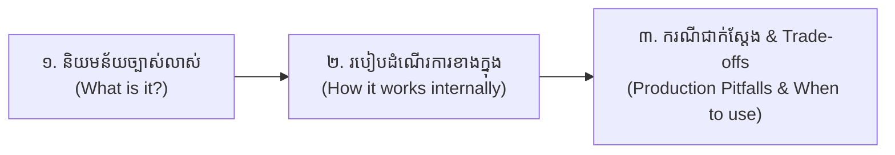

# មគ្គុទ្ទេសក៍ត្រៀមសម្ភាសន៍ការងារ Java & Spring Boot Developer (ខេមរភាសា) 🇰🇭

> **ឃ្លាំងឯកសារ និងកម្រងសំណួរ-ចម្លើយកម្រិតស៊ីជម្រៅ សម្រាប់ត្រៀមប្រឡង និងសម្ភាសន៍ចូលធ្វើការជា Java & Spring Boot Backend Engineer គ្រប់កម្រិត (Junior, Mid, Senior & Lead Developer)**

> 🌐 **ភាសា / Language:** 🇰🇭 **[ភាសាខ្មែរ (Khmer)](README.kh.md)** | 🇬🇧 [English](README.md)

---

## 📖 អំពីឃ្លាំងមគ្គុទ្ទេសក៍នេះ (About This Handbook)

នៅក្នុងទីផ្សារការងារសូហ្វវែរបច្ចុប្បន្ន ទាំងនៅក្នុងប្រទេសកម្ពុជា (ធនាគារ, ស្ថាប័នមីក្រូហិរញ្ញវត្ថុ, ក្រុមហ៊ុន FinTech, ក្រុមហ៊ុនទូរគមនាគមន៍, និងស្ថាប័នរដ្ឋ) ក៏ដូចជាទីផ្សារការងារអន្តរជាតិពីចម្ងាយ (Remote Tech Roles) **Java & Spring Boot** គឺជាជំនាញដែលមានតម្រូវការខ្ពស់បំផុត និងផ្តល់ប្រាក់បៀវត្សរ៍ខ្ពស់បំផុត។

ទោះជាយ៉ាងណា ការសម្ភាសន៍ការងារបច្ចុប្បន្នមិនមែនសួរត្រឹមតែ "តើ Java ជាអ្វី?" ឬ "តើ Spring Boot ជាអ្វី?" នោះឡើយ។ អ្នកសម្ភាសន៍កម្រិត Senior/Tech Lead នឹងជីកកកាយយ៉ាងជ្រៅទៅលើ៖
1. **ឫសគល់ខាងក្នុង (Internals):** តើ JVM គ្រប់គ្រង Memory យ៉ាងដូចម្តេច? តើ Spring Container បង្កើត Proxy ដោយរបៀបណា?
2. **បញ្ហាជាក់ស្តែងក្នុង Production (Real-World Pitfalls):** របៀបដោះស្រាយ N+1 Query Problem, Race Condition, Memory Leaks, និង Cascading Outages។
3. **ស្ថាបត្យកម្មប្រព័ន្ធ (System Architecture):** ការរៀបចំ Microservices, Distributed Transactions (Saga Pattern), Event-Driven Architecture ជាមួយ Kafka, និងការការពារសុវត្ថិភាពជាមួយ OAuth2/JWT។

ឃ្លាំងមេរៀននេះត្រូវបានស្រាវជ្រាវ និងចម្រាញ់ចេញពីវេទិកាសម្ភាសន៍ការងារធំៗបំផុតលើពិភពលោក (**GeeksforGeeks**, **Baeldung**, **Roadmap.sh**, **LeetCode**) រួមជាមួយបទពិសោធន៍វិស្វកម្មជាក់ស្តែង ដើម្បីជួយឱ្យអ្នកអភិវឌ្ឍន៍ត្រៀមខ្លួនបាន ១០០% ប្រកបដោយទំនុកចិត្ត។

---

## 🗺️ ផែនទីបង្ហាញផ្លូវត្រៀមសម្ភាសន៍ការងារ (Interview Preparation Roadmap)

---

## 📚 មាតិកាស្នូលទាំង ១២ Modules (The 12 Master Pillars)

| Module | ប្រធានបទស្នូល (Core Topic) | ខ្លឹមសារ និងសំណួរសម្ភាសន៍សំខាន់ៗ |
| :---: | :--- | :--- |
| **01** | [Core Java & JVM Internals](01-core-java-and-jvm-internals/README.kh.md) | JVM Architecture, Heap vs Stack, Metaspace, GC (G1/ZGC), String Pool, Java 8-21 Features |
| **02** | [OOP, SOLID & Design Patterns](02-oop-solid-and-design-patterns/README.kh.md) | គោលការណ៍ OOP ទាំង ៤, SOLID Principles ជាមួយកូដជាក់ស្តែង, Singleton, Factory, Strategy, Proxy |
| **03** | [Concurrency, Multithreading & Virtual Threads](03-concurrency-multithreading-virtual-threads/README.kh.md) | Thread Lifecycle, `synchronized`, `volatile`, ReentrantLock, ThreadPools, Java 21 Virtual Threads |
| **04** | [Spring Framework Core Architecture](04-spring-framework-core-architecture/README.kh.md) | IoC Container, Dependency Injection Types, Bean Lifecycle & Scopes, BeanPostProcessor, AOP |
| **05** | [Spring Boot Deep Dive & Production](05-spring-boot-deep-dive-and-production/README.kh.md) | Auto-Configuration internals, Starters & BOM, Embedded Tomcat, Profiles, Actuator Metrics |
| **06** | [SQL, Database Indexing & Spring Data JPA](06-sql-database-indexing-spring-data-jpa/README.kh.md) | B-Tree Indexes, ACID Isolation, Transaction Propagation, N+1 Problem, Optimistic/Pessimistic Locking |
| **07** | [Microservices & System Design Patterns](07-microservices-and-system-design-patterns/README.kh.md) | Service Discovery, API Gateway, Saga Pattern (Transactions), CQRS, Resilience4j Circuit Breakers |
| **08** | [Event-Driven Architecture & Apache Kafka](08-event-driven-architecture-and-kafka/README.kh.md) | Topics, Partitions, Consumer Groups, Offsets, Exactly-once processing, DLQ Error Handling |
| **09** | [Spring Security, JWT & OAuth2](09-spring-security-jwt-and-oauth2/README.kh.md) | SecurityFilterChain, Stateless JWT Architecture, OAuth2/OIDC PKCE Grant, Method RBAC |
| **10** | [Automated Testing & Testcontainers](10-automated-testing-junit-mockito-testcontainers/README.kh.md) | JUnit 5, Mockito Stubbing & Verification, `@WebMvcTest`, Real Containers ជាមួយ Testcontainers |
| **11** | [DevOps, Docker, Kubernetes & Observability](11-devops-docker-kubernetes-observability/README.kh.md) | Multi-stage Dockerfile, Kubernetes Pods/Deployments/Ingress, Distributed Tracing (Zipkin, Jaeger) |
| **12** | [System Design, Live Coding & STAR Method](12-system-design-scenarios-and-live-coding/README.kh.md) | Rate Limiter, URL Shortener, Top 20 Coding Patterns, Behavioral STAR Method & Resume Tips |

---

## 🎯 យុទ្ធសាស្ត្រឆ្លើយសម្ភាសន៍៖ អ្វីដែលអ្នកសម្ភាសន៍ចង់ឮ (Interviewer Expectations)

ពេលឆ្លើយសំណួរបច្ចេកទេសក្នុងសម្ភាសន៍ សូមចងចាំនូវ **រូបមន្ត ៣ ជំហាន (The 3-Step Answer Framework)**៖

1. **ជំហានទី ១ (Definition):** ផ្តល់និយមន័យខ្លី ខ្លឹម និងត្រង់ចំគោលដៅ មិនបាច់បកស្រាយវាងវៃ។
2. **ជំហានទី ២ (Internal Mechanics):** បង្ហាញពីរបៀបដែលវាដំណើរការនៅពីក្រោយឆាក (Under the hood) ដូចជា Data Structure ដែលប្រើ ឬ Flow នៃកូដ។
3. **ជំហានទី ៣ (Trade-offs & Production Experience):** បញ្ជាក់ពីចំណុចល្អ ចំណុចខ្សោយ និងបទពិសោធន៍ផ្ទាល់ខ្លួនពេលជួបបញ្ហានៅក្នុងគម្រោងជាក់ស្តែង។ នេះជាចំណុចដែលញែកដាច់រវាង **Junior Developer** និង **Senior Engineer**!

---

## 🌐 ប្រភពឯកសារយោងធំៗ (References & Sources)

- [GeeksforGeeks Java Interview Questions](https://www.geeksforgeeks.org/java-interview-questions/)
- [GeeksforGeeks Spring Boot Interview Questions](https://www.geeksforgeeks.org/spring-boot-interview-questions/)
- [GeeksforGeeks Microservices System Design](https://www.geeksforgeeks.org/system-design/microservices/)
- [Baeldung Spring & Java Tutorials](https://www.baeldung.com/)
- [Roadmap.sh Java & Spring Boot Developer Roadmaps](https://roadmap.sh/java)
