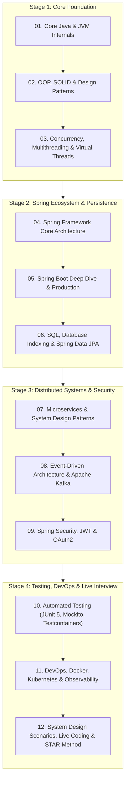
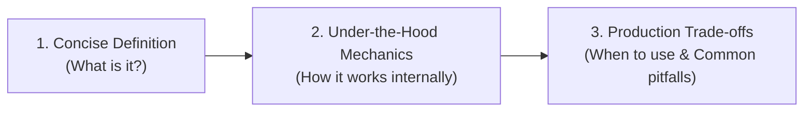

# Java & Spring Boot Developer Career & Technical Interview Handbook

> **A Comprehensive, Production-Grade Technical Interview Preparation Handbook for Modern Java & Spring Boot Backend Engineers (Junior, Mid, Senior & Lead Developer Levels)**

> 🌐 **Language / ភាសា:** 🇬🇧 **[English](README.md)** | 🇰🇭 [ភាសាខ្មែរ (Khmer)](README.kh.md)

---

## 📖 About This Handbook

In today's software engineering market—ranging from premier financial institutions, telecom giants, and fintech unicorns in Southeast Asia to global distributed tech companies—**Java & Spring Boot** remains the undisputed backbone for mission-critical enterprise platforms.

However, technical interviews today rarely stop at textbook definitions. Senior hiring managers, Principal Architects, and Engineering Directors aggressively examine:
1. **Under-the-Hood Mechanics:** How does the JVM execute bytecode and manage memory? How do Spring runtime proxies intercept method calls?
2. **Production Pitfalls & Trade-offs:** How do you troubleshoot the N+1 query problem, mitigate concurrency race conditions, diagnose memory leaks, and prevent cascading system outages?
3. **Distributed Systems & Architecture:** How do you orchestrate microservices, handle distributed transactions with the Saga Pattern, implement event-driven architecture using Kafka, and enforce zero-trust security with OAuth 2.0/OIDC and JWT?

This handbook synthesizes battle-tested engineering experience with comprehensive syllabi from the world's most authoritative interview portals (**GeeksforGeeks**, **Baeldung**, **Roadmap.sh**, and **LeetCode**) to give you 100% confidence in technical interviews.

---

## 🗺️ Master Preparation Roadmap

---

## 📚 The 12 Master Pillars

| Module | Core Topic | Key Interview Concepts & In-Depth Questions |
| :---: | :--- | :--- |
| **01** | [Core Java & JVM Internals](01-core-java-and-jvm-internals/README.md) | JVM Architecture, Heap vs Stack, Metaspace, GC (G1/ZGC), String Pool, Java 8-21 Features |
| **02** | [OOP, SOLID & Design Patterns](02-oop-solid-and-design-patterns/README.md) | 4 OOP Pillars, SOLID Principles in Action, Singleton, Factory, Strategy, Proxy Patterns |
| **03** | [Concurrency, Multithreading & Virtual Threads](03-concurrency-multithreading-virtual-threads/README.md) | Thread Lifecycle, `synchronized`, `volatile`, ReentrantLock, ThreadPools, Java 21 Virtual Threads |
| **04** | [Spring Framework Core Architecture](04-spring-framework-core-architecture/README.md) | IoC Container, Dependency Injection Types, Bean Lifecycle & Scopes, BeanPostProcessor, AOP |
| **05** | [Spring Boot Deep Dive & Production](05-spring-boot-deep-dive-and-production/README.md) | Auto-Configuration internals, Starters & BOM, Embedded Tomcat, Profiles, Actuator Metrics |
| **06** | [SQL, Database Indexing & Spring Data JPA](06-sql-database-indexing-spring-data-jpa/README.md) | B-Tree Indexes, ACID Isolation, Transaction Propagation, N+1 Problem, Optimistic/Pessimistic Locking |
| **07** | [Microservices & System Design Patterns](07-microservices-and-system-design-patterns/README.md) | Service Discovery, API Gateway, Saga Pattern (Transactions), CQRS, Resilience4j Circuit Breakers |
| **08** | [Event-Driven Architecture & Apache Kafka](08-event-driven-architecture-and-kafka/README.md) | Topics, Partitions, Consumer Groups, Offsets, Exactly-once processing, DLQ Error Handling |
| **09** | [Spring Security, JWT & OAuth2](09-spring-security-jwt-and-oauth2/README.md) | SecurityFilterChain, Stateless JWT Architecture, OAuth2/OIDC PKCE Grant, Method RBAC |
| **10** | [Automated Testing & Testcontainers](10-automated-testing-junit-mockito-testcontainers/README.md) | JUnit 5, Mockito Stubbing & Verification, `@WebMvcTest`, Real Containers with Testcontainers |
| **11** | [DevOps, Docker, Kubernetes & Observability](11-devops-docker-kubernetes-observability/README.md) | Multi-stage Dockerfile, Kubernetes Pods/Deployments/Ingress, Distributed Tracing (Zipkin, Jaeger) |
| **12** | [System Design, Live Coding & STAR Method](12-system-design-scenarios-and-live-coding/README.md) | Rate Limiter, URL Shortener, Top 20 Coding Patterns, Behavioral STAR Method & Resume Tips |

---

## 🎯 Technical Interview Answering Strategy: The 3-Step Framework

When answering technical interview questions, apply this structured framework:

1. **Step 1 (Clear Definition):** Deliver a direct, accurate definition without beating around the bush.
2. **Step 2 (Internal Mechanics):** Explain how it functions under the hood (data structures, bytecode instructions, lifecycle steps).
3. **Step 3 (Production Trade-offs & Experience):** Discuss performance implications, edge cases, and real-world project challenges. This immediately separates a **Junior Developer** from an experienced **Senior Engineer**!

---

## 🌐 Primary References

- [GeeksforGeeks Java Interview Questions](https://www.geeksforgeeks.org/java-interview-questions/)
- [GeeksforGeeks Spring Boot Interview Questions](https://www.geeksforgeeks.org/spring-boot-interview-questions/)
- [GeeksforGeeks Microservices System Design](https://www.geeksforgeeks.org/system-design/microservices/)
- [Baeldung Spring & Java Tutorials](https://www.baeldung.com/)
- [Roadmap.sh Java & Spring Boot Developer Roadmaps](https://roadmap.sh/java)
