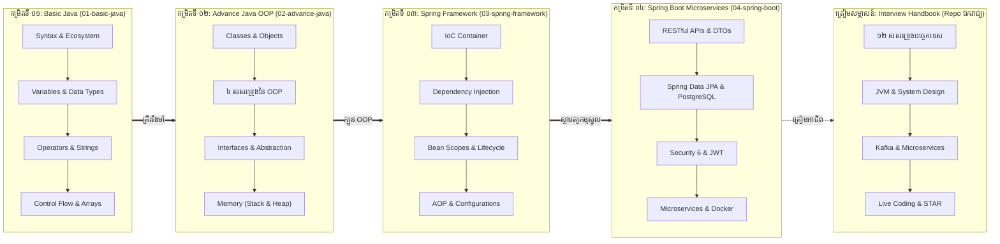

# កម្រងវគ្គសិក្សាវិស្វកម្មសូហ្វវែរ Java & Spring ☕

> **កម្មវិធីសិក្សាវិស្វកម្មសូហ្វវែរពេញលេញ៖ ភាសា Java (LTS 17/21), Object-Oriented Programming (OOP), ស្ថាបត្យកម្មស្នូល Spring Framework, សេវាសហគ្រាស Spring Boot RESTful Microservices និងមគ្គុទ្ទេសក៍ត្រៀមសម្ភាសន៍ការងារ។**

---

## 🏛️ វគ្គសិក្សាស្នូលទាំង ៤ (Four Master Course Tracks)

កម្មវិធីសិក្សានេះត្រូវបានរៀបចំឡើងជា **៤ ដំណាក់កាលបន្តបន្ទាប់គ្នា (១៣៦ មេរៀន និង ២៣៤ ស្លាយបង្រៀន)** ដើម្បីបណ្តុះបណ្តាលអ្នកអភិវឌ្ឍន៍ចាប់ពីកម្រិតដំបូងរហូតដល់កម្រិតវិស្វករសូហ្វវែរសហគ្រាស៖

> [!TIP]
> ### 💼 កញ្ចប់ឯកសារពិសេស៖ មគ្គុទ្ទេសក៍ត្រៀមសម្ភាសន៍ការងារ Java & Spring Boot
> តើអ្នកកំពុងត្រៀមខ្លួនសម្ភាសន៍ការងារ ឬចង់ពង្រឹងស្ថាបត្យកម្មប្រព័ន្ធកម្រិតខ្ពស់មែនទេ? យើងបានបំបែកសៀវភៅនេះជា Repo ដាច់ដោយឡែកមួយយ៉ាងពេញលេញ៖
> 👉 **[sakousa856-sketch/java-spring-interview-handbook-khmer](https://github.com/sakousa856-sketch/java-spring-interview-handbook-khmer)** (១២ ជំពូកធំៗ គ្របដណ្ដប់លើ JVM Internals, Spring Architecture, System Design, និង Live Coding)។

---

## 🗺️ ផែនទីបង្ហាញផ្លូវអាជីព Java Full Stack (Master Career Roadmap)

តើអ្នកចង់ដឹងពីផែនទីបង្ហាញផ្លូវលម្អិតពីរបៀបរៀន និងពេលវេលាដែលត្រូវចំណាយដែរឬទេ?
👉 **[បើកមើលផែនទីបង្ហាញផ្លូវពេញលេញ (ROADMAP.md)](ROADMAP.md)**

---

## 📚 រចនាសម្ព័ន្ធ និងច្រកចូលនៃវគ្គនីមួយៗ (Curriculum Portals)

| ល.រ | វគ្គសិក្សា | ខ្លឹមសារ និងគោលបំណង | ចំនួនមេរៀន / ស្លាយ | ច្រកចូលសិក្សា |
| :---: | :--- | :--- | :---: | :---: |
| **01** | **[មូលដ្ឋានគ្រឹះ Java (Basic Java)](01-basic-java/README.md)** | Syntax គ្រឹះ, Primitives, Control Flow, Loops, Arrays, Scanner | **១៨ មេរៀន (៨៧ ស្លាយ)** | [ចូលរៀនវគ្គ ០១ →](01-basic-java/README.md) |
| **02** | **[Java កម្រិតខ្ពស់ OOP (Advance Java)](02-advance-java/README.md)** | Encapsulation, Inheritance, Polymorphism, Abstraction, Memory | **១៨ មេរៀន (៨៦ ស្លាយ)** | [ចូលរៀនវគ្គ ០២ →](02-advance-java/README.md) |
| **03** | **[ស្ថាបត្យកម្មស្នូល Spring Framework](03-spring-framework/README.md)** | IoC Container, Dependency Injection, Bean Lifecycles, AOP | **២៤ ជំពូក (៦១ ស្លាយ)** | [ចូលរៀនវគ្គ ០៣ →](03-spring-framework/README.md) |
| **04** | **[Spring Boot & Microservices](04-spring-boot/README.md)** | RESTful APIs, Spring Data JPA, JWT Security, Microservices, Docker | **១០ Modules (៧៨ មេរៀន)** | [ចូលរៀនវគ្គ ០៤ →](04-spring-boot/README.md) |
| **⭐** | **[មគ្គុទ្ទេសក៍ត្រៀមសម្ភាសន៍ការងារ](https://github.com/sakousa856-sketch/java-spring-interview-handbook-khmer)** | ១២ មូលដ្ឋានបច្ចេកទេស, JVM Internals, System Design, Coding | **១២ Master Pillars** | [បើកមើល Repo សម្ភាសន៍ →](https://github.com/sakousa856-sketch/java-spring-interview-handbook-khmer) |

---

## ☕ កម្រិតទី ០១៖ មូលដ្ឋានគ្រឹះ Java (`01-basic-java/`)

ច្រកទ្វារដំបូងគេបង្អស់សម្រាប់អ្នកចាប់ផ្តើមរៀនភាសា Java៖

* 📖 **[មាតិកាមេរៀនលម្អិតកម្រិតទី ០១](01-basic-java/README.md)**
* 📊 **[កាតាឡុកស្លាយបង្រៀន ៨៧ ស្លាយ](01-basic-java/slides/README.md)**

| # | ឈ្មោះមេរៀន | ចំណុចសំខាន់ៗដែលត្រូវរៀន |
| :-: | :--- | :--- |
| **01** | [ប្រវត្តិនៃ Java](01-basic-java/01-history-of-java/README.md) | លោក James Gosling, Green Project, Oak ទៅ Java, WWW (1993) |
| **02** | [Version របស់ Java](01-basic-java/02-java-versions/README.md) | បន្ទាត់ពេលវេលា Version, LTS (8, 11, 17, 21), យន្តការ JDK vs JRE vs JVM |
| **03** | [លក្ខណៈពិសេសរបស់ Java](01-basic-java/03-features-of-java/README.md) | Platform Independent (WORA), Object-Oriented, Robust, Secure |
| **04** | [កម្មវិធីដំបូង](01-basic-java/04-first-program/README.md) | ការ Compile ជាមួយ `javac`, ការ Run ជាមួយ `java`, Bytecode |
| **05** | [ទម្រង់នៃកម្មវិធី](01-basic-java/05-java-program-structure/README.md) | Class Declaration, ធាតុផ្សំនៃ `main()` method, Syntax Rules |
| **06** | [ការបញ្ចេញលទ្ធផល](01-basic-java/06-java-output/README.md) | ប្រៀបធៀប `print()` vs `println()`, ការតភ្ជាប់ String, Escape Sequences |
| **07** | [កំណត់សម្គាល់កូដ](01-basic-java/07-java-comments/README.md) | Single-line, Multi-line, Javadoc, គោលការណ៍ Clean Code |
| **08** | [អថេរក្នុង Java](01-basic-java/08-java-variables/README.md) | ទីតាំងក្នុង Memory, Syntax ប្រកាសអថេរ, ក្បួនដាក់ឈ្មោះ, ពាក្យ `final` |
| **09** | [ប្រភេទនៃទិន្នន័យ](01-basic-java/09-java-data-types/README.md) | ៨ ប្រភេទ Primitive types vs Reference types, ទំហំ Bit-width |
| **10** | [ការបំប្លែងប្រភេទ](01-basic-java/10-java-type-casting/README.md) | Widening Casting (ស្វ័យប្រវត្ត) vs Narrowing Casting (ដោយដៃ) |
| **11** | [ការទទួលទិន្នន័យពី Keyboard](01-basic-java/11-java-user-input/README.md) | Class `java.util.Scanner`, Input methods នីមួយៗ, ដោះស្រាយបញ្ហា Newline |
| **12** | [ប្រមាណវិធីក្នុង Java](01-basic-java/12-java-operators/README.md) | ប្រមាណវិធីនព្វន្ធ, ការផ្តល់តម្លៃ, ប្រៀបធៀប, និងតក្កវិទ្យា |
| **13** | [Java Math Class](01-basic-java/13-java-mathematic/README.md) | Class `java.lang.Math` (`sqrt`, `abs`, `max`, `min`, `random`) |
| **14** | [ខ្សែអក្សរក្នុង Java](01-basic-java/14-java-strings/README.md) | String methods (`length`, `toUpperCase`), លក្ខណៈ Immutability |
| **15** | [លក្ខខណ្ឌសម្រេចចិត្ត](01-basic-java/15-java-if-else/README.md) | ការសម្រេចចិត្ត `if`, `else`, `else if`, Ternary Operator (`? :`) |
| **16** | [ការសម្រេចចិត្តតាមជម្រើស](01-basic-java/16-java-switch/README.md) | លក្ខខណ្ឌច្រើនជម្រើស, `case`, សារៈសំខាន់នៃ `break`, `default` |
| **17** | [រង្វិលជុំ](01-basic-java/17-java-loops/README.md) | `while`, `do-while`, `for`, `for-each`, ការបញ្ឈប់ និងរំលង (`break`, `continue`) |
| **18** | [អារេក្នុង Java](01-basic-java/18-java-arrays/README.md) | 1D Arrays, `.length`, Loop តាម for-each, អារេ ២ វិមាត្រ (2D) |

---

## 🏛️ កម្រិតទី ០២៖ Java កម្រិតខ្ពស់ OOP (`02-advance-java/`)

ស្វែងយល់ពីក្បួនរចនាសូហ្វវែរតាមបែប Object-Oriented និង JVM Memory Model៖

* 📖 **[មាតិកាមេរៀនលម្អិតកម្រិតទី ០២](02-advance-java/README.md)**
* 📊 **[កាតាឡុកស្លាយបង្រៀន ៨៦ ស្លាយ](02-advance-java/slides/README.md)**

---

## 🍃 កម្រិតទី ០៣៖ ស្ថាបត្យកម្មស្នូល Spring Framework (`03-spring-framework/`)

យល់ច្បាស់ពីម៉ាស៊ីនស្នូលរបស់ Spring មុននឹងឈានទៅកាន់ Spring Boot៖

* 📖 **[មាតិកាមេរៀនលម្អិតកម្រិតទី ០៣](03-spring-framework/README.md)**
* 📊 **[កាតាឡុកស្លាយបង្រៀន ៦១ ស្លាយ](03-spring-framework/slides/README.md)**

---

## 🚀 កម្រិតទី ០៤៖ Spring Boot & Enterprise Microservices (`04-spring-boot/`)

កសាង Production-Ready RESTful Web Services, Security និង Microservices៖

* 📖 **[មាតិកាមេរៀន និងគម្រោងអនុវត្តជាក់ស្តែង](04-spring-boot/README.md)**

---

## 💼 ឃ្លាំងឯកសារពិសេស៖ មគ្គុទ្ទេសក៍ត្រៀមសម្ភាសន៍ការងារ

តើអ្នកកំពុងស្វែងរកកម្រងសំណួរ-ចម្លើយស៊ីជម្រៅ គំរូស្ថាបត្យកម្មប្រព័ន្ធ (System Design) និងលំហាត់ Live Coding មែនទេ?
យើងបានរៀបចំវាទៅជា Repo ដាច់ដោយឡែកមួយយ៉ាងពេញលេញ និងមានការគាំទ្រខ្ពស់៖

👉 **[sakousa856-sketch/java-spring-interview-handbook-khmer](https://github.com/sakousa856-sketch/java-spring-interview-handbook-khmer)**

- **១២ សសរទ្រូងស្នូល (12 Master Pillars):** JVM Internals, OOP & SOLID, Multithreading & Virtual Threads, Spring Framework & Boot Core, SQL & JPA Indexing, Microservices, Event-Driven Kafka, Security, Testing, DevOps, និង System Design។
- **ទម្រង់ពីរភាសា (Bilingual):** ការពន្យល់ជាភាសាខ្មែរ និងអង់គ្លេស អមដោយ Code ជាក់ស្តែង និងការវិភាគ Architectural Trade-offs។

---

## 📜 អាជ្ញាប័ណ្ណ (License)

កម្រងវគ្គសិក្សានេះគឺជា Open Source ក្រោមអាជ្ញាប័ណ្ណ [MIT License](LICENSE)។
