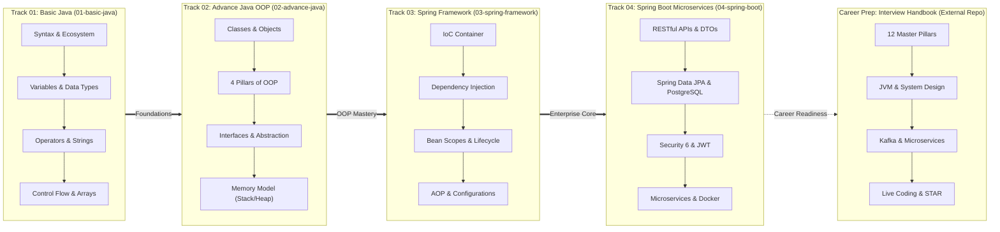

# Java & Spring Master Engineering Series ☕

> **A Comprehensive Software Engineering Curriculum: Java (LTS 17/21), Object-Oriented Programming (OOP), Spring Framework Core Architecture, Spring Boot Enterprise RESTful Microservices, and Technical Interview Preparation.**

> 🌐 **Language / ភាសា:** [ភាសាខ្មែរ (Khmer)](README.kh.md) | **🇬🇧 English**

---

## 🏛️ Four Master Course Tracks

This curriculum is structured into **4 sequential tracks (136 lessons & 234 slide decks)** designed to train developers from ground zero to enterprise-grade backend and full-stack software engineers:

> [!TIP]
> ### 💼 Bonus Career Kit: Java & Spring Boot Interview Handbook
> Are you actively preparing for technical interviews or job placement? Check out our dedicated standalone repository:
> 👉 **[sakousa856-sketch/java-spring-interview-handbook-khmer](https://github.com/sakousa856-sketch/java-spring-interview-handbook-khmer)** (12 Master Pillars covering Core Java Internals, Spring Internals, System Design, and Live Coding).

---

## 🗺️ Master Full Stack Career Roadmap

Looking for the overarching roadmap to guide your learning timeline?
👉 **[Open Complete Java Full Stack Web Development Roadmap (ROADMAP.md)](ROADMAP.md)**

---

## 📚 Curriculum Structure & Portals

| Track | Title | Scope & Objectives | Content Scope | Portal Link |
| :---: | :--- | :--- | :---: | :---: |
| **01** | **[Basic Java Fundamentals](01-basic-java/README.md)** | Core syntax, primitives, control flow, loops, arrays, scanner | **18 Lessons (87 Slides)** | [Open Track 01 →](01-basic-java/README.md) |
| **02** | **[Advance Java OOP](02-advance-java/README.md)** | Encapsulation, inheritance, polymorphism, abstraction, memory | **18 Lessons (86 Slides)** | [Open Track 02 →](02-advance-java/README.md) |
| **03** | **[Spring Framework Core](03-spring-framework/README.md)** | Inversion of Control (IoC), Dependency Injection, Bean Lifecycles | **24 Lessons (61 Slides)** | [Open Track 03 →](03-spring-framework/README.md) |
| **04** | **[Spring Boot & Microservices](04-spring-boot/README.md)** | RESTful APIs, Spring Data JPA, JWT Security, Microservices, Docker | **10 Modules (78 Lessons)** | [Open Track 04 →](04-spring-boot/README.md) |
| **⭐** | **[Technical Interview Handbook](https://github.com/sakousa856-sketch/java-spring-interview-handbook-khmer)** | 12 technical pillars, JVM internals, system design, LeetCode patterns | **12 Master Pillars** | [Open Handbook Repo →](https://github.com/sakousa856-sketch/java-spring-interview-handbook-khmer) |

---

## ☕ Track 01: Basic Java Fundamentals (`01-basic-java/`)

The essential entry point for every software engineer learning Java:

* 📖 **[Track 01 Syllabus & Lessons](01-basic-java/README.md)**
* 📊 **[87 Presentation Slides Catalog](01-basic-java/slides/README.md)**

| # | Lesson Title | Key Highlights |
| :-: | :--- | :--- |
| **01** | [History of Java](01-basic-java/01-history-of-java/README.md) | James Gosling, Green Project, Oak to Java, WWW (1993) |
| **02** | [Java Versions & Ecosystem](01-basic-java/02-java-versions/README.md) | Version timeline, LTS (8, 11, 17, 21), JDK vs JRE vs JVM |
| **03** | [Features of Java](01-basic-java/03-features-of-java/README.md) | Platform Independent (WORA), Object-Oriented, Robust, Secure |
| **04** | [First Java Program](01-basic-java/04-first-program/README.md) | Compilation with `javac`, execution with `java`, Bytecode |
| **05** | [Program Structure](01-basic-java/05-java-program-structure/README.md) | Class declaration, `main()` method anatomy, syntax rules |
| **06** | [Java Output](01-basic-java/06-java-output/README.md) | `print()` vs `println()`, concatenation, escape sequences |
| **07** | [Java Comments](01-basic-java/07-java-comments/README.md) | Single-line, multi-line, Javadoc formatting, clean code practices |
| **08** | [Java Variables](01-basic-java/08-java-variables/README.md) | Memory location, syntax, variable naming rules, `final` keyword |
| **09** | [Java Data Types](01-basic-java/09-java-data-types/README.md) | 8 Primitive types vs Reference types, bit-width & ranges |
| **10** | [Java Type Casting](01-basic-java/10-java-type-casting/README.md) | Widening casting (automatic) vs Narrowing casting (manual) |
| **11** | [Java User Input](01-basic-java/11-java-user-input/README.md) | Keyboard input with `java.util.Scanner`, input handling |
| **12** | [Java Operators](01-basic-java/12-java-operators/README.md) | Arithmetic, assignment, comparison, and logical operators |
| **13** | [Java Mathematic](01-basic-java/13-java-mathematic/README.md) | Built-in `java.lang.Math` methods (`sqrt`, `abs`, `random`) |
| **14** | [Java Strings](01-basic-java/14-java-strings/README.md) | String methods (`length`, `toUpperCase`), immutability |
| **15** | [Java If..Else](01-basic-java/15-java-if-else/README.md) | Decision making, `if`, `else`, `else if`, Ternary Operator (`? :`) |
| **16** | [Java Switch](01-basic-java/16-java-switch/README.md) | Multi-branch conditions, `case`, `break`, `default` |
| **17** | [Java Loops](01-basic-java/17-java-loops/README.md) | `while`, `do-while`, `for`, `for-each`, `break` & `continue` |
| **18** | [Java Arrays](01-basic-java/18-java-arrays/README.md) | 1D arrays, `.length`, traversal, 2D matrix arrays |

---

## 🏛️ Track 02: Advance Java OOP (`02-advance-java/`)

Mastering Object-Oriented Software Design and the JVM Memory Model:

* 📖 **[Track 02 Syllabus & Lessons](02-advance-java/README.md)**
* 📊 **[86 Presentation Slides Catalog](02-advance-java/slides/README.md)**

---

## 🍃 Track 03: Spring Framework Core (`03-spring-framework/`)

Understanding the Core Engine of Spring before jumping into Spring Boot:

* 📖 **[Track 03 Syllabus & Lessons](03-spring-framework/README.md)**
* 📊 **[61 Presentation Slides Catalog](03-spring-framework/slides/README.md)**

---

## 🚀 Track 04: Spring Boot & Enterprise Microservices (`04-spring-boot/`)

Building Production-Ready RESTful Web Services, Security, and Microservices:

* 📖 **[Track 04 Modules & Projects](04-spring-boot/README.md)**

---

## 💼 Dedicated Repository: Technical Interview Handbook

Looking for deep technical interview questions, architecture patterns, and live coding exercises?
We have packaged this into an independent, high-impact repository:

👉 **[sakousa856-sketch/java-spring-interview-handbook-khmer](https://github.com/sakousa856-sketch/java-spring-interview-handbook-khmer)**

- **12 Master Pillars:** JVM Internals, OOP & SOLID, Multithreading, Spring Framework & Boot, SQL/JPA, Microservices, Kafka, Security, Testing, DevOps, and System Design.
- **Bilingual Content:** Khmer and English explanations with code snippets and architectural trade-offs.

---

## 📜 License

This master curriculum is open source and available under the [MIT License](LICENSE).
