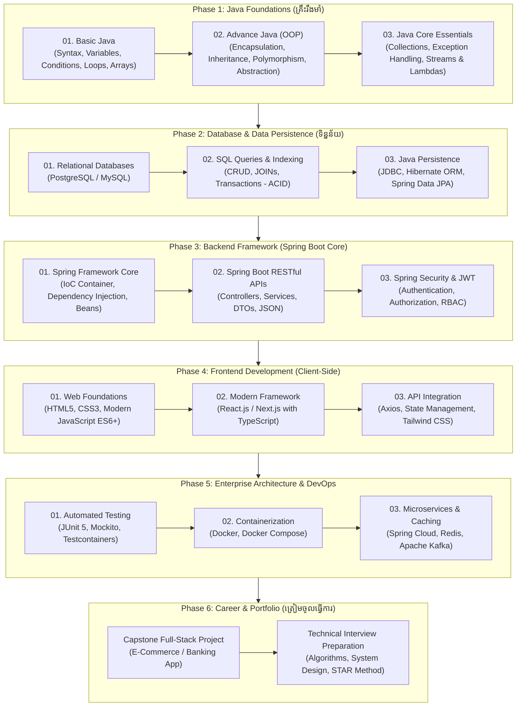

# 🗺️ ផែនទីបង្ហាញផ្លូវ៖ Java Full Stack Web Development Roadmap

> **មគ្គុទ្ទេសក៍ផែនទីបង្ហាញផ្លូវពេញលេញ (Full Roadmap) សម្រាប់ការសិក្សា និងអភិវឌ្ឍជំនាញក្លាយជា Java Full Stack Developer អាជីព ចាប់ពីកម្រិតដំបូង (Zero) រហូតដល់កម្រិតវិស្វកម្មសូហ្វវែរសហគ្រាស (Enterprise Software Engineer)។**

---

## 🎯 ១. តើអ្វីជា Java Full Stack Developer? (Why Java Full Stack?)

**Java Full Stack Developer** គឺជាវិស្វករសូហ្វវែរដែលអាចបង្កើតប្រព័ន្ធកម្មវិធីបានទាំងសងខាង៖
* 🖥️ **Client-Side (Frontend):** User Interface (UI) ដែលស្អាត និងមានប្រតិកម្មលឿន (HTML5, CSS3, JavaScript, React/Next.js)។
* ⚙️ **Server-Side (Backend):** ប្រព័ន្ធកណ្តាលដ៏រឹងមាំសម្រាប់ដំណើរការ Business Logic, Security និង APIs (Java, Spring Boot, Microservices)។
* 🗄️ **Database & Cloud (Data Layer & DevOps):** ការរក្សាទុកទិន្នន័យ (PostgreSQL, MySQL, Redis) និងការដាក់ឱ្យដំណើរការលើ Server (Docker, AWS, CI/CD)។

> [!NOTE]
> **ហេតុអ្វីបានជាទីផ្សារការងារ (ពិសេសនៅកម្ពុជា) ត្រូវការ Java & Spring Boot ខ្លាំង?**
> * 🏦 **ស្ថាប័នហិរញ្ញវត្ថុ និងធនាគារ (Fintech & Banking):** ធនាគារធំៗនៅកម្ពុជាដូចជា ABA Bank, Canadia Bank, Wing Bank, Sathapana, TrueMoney សុទ្ធតែជ្រើសរើស Java & Spring Boot ជាឆ្អឹងខ្នង (Backbone) នៃប្រព័ន្ធ Core Banking និង Payment Gateway។
> * 💼 **ប្រាក់ខែ និងឱកាសការងារខ្ពស់:** វិស្វករ Java & Spring ទទួលបានកម្រិតប្រាក់ខែខ្ពស់ និងមានស្ថិរភាពការងារយូរអង្វែង។

---

## 🧭 ២. ដ្យាក្រាមផែនទីបង្ហាញផ្លូវធំ (Master Architecture Roadmap)

---

## 📚 ៣. ដំណាក់កាលលម្អិតទាំង ៦ (The 6-Phase Curriculum)

---

### 🟢 ដំណាក់កាលទី ១៖ មូលដ្ឋានគ្រឹះ Java (Phase 1: Core Java Mastery)

> 🎯 **គោលបំណង:** កសាងមូលដ្ឋានគ្រឹះភាសា Java ឱ្យរឹងមាំ យល់ច្បាស់ពី Memory Model និងក្បួន Object-Oriented Programming (OOP)។

#### 📋 ខ្លឹមសារមេរៀនលម្អិត៖
1. **Basic Java Fundamentals (១៨ មេរៀន):**
   * History of Java, Java Versions (LTS 8, 11, 17, 21), JVM / JRE / JDK
   * Java Syntax, `System.out.println()`, Comments, Naming Conventions
   * Data Types (Primitive vs Reference), Type Casting (Widening vs Narrowing)
   * User Input ជាមួយ `Scanner`
   * Operators (Arithmetic, Relational, Logical, Bitwise)
   * Control Flow: `if..else`, Short-hand Ternary (`? :`), `switch-case`
   * Loops: `for`, `while`, `do-while`, `for-each`, `break` & `continue`
   * Arrays: 1D Arrays, 2D Arrays, Iteration
2. **Advance Java (Object-Oriented Programming - OOP):**
   * Class & Object, Fields, Methods, Constructors
   * Access Modifiers (`public`, `private`, `protected`, default)
   * **៤ សសរទ្រូងនៃ OOP (4 Pillars):**
     - **Encapsulation:** Getters/Setters, Data Hiding
     - **Inheritance:** `extends`, `super`, Method Overriding
     - **Polymorphism:** Compile-time (Overloading) vs Run-time (Overriding)
     - **Abstraction:** Abstract Classes vs Interfaces
   * Java Memory Internals: Stack Memory vs Heap Memory, Garbage Collection (GC)
3. **Java Core Essentials:**
   * **Collections Framework:** `List` (`ArrayList`, `LinkedList`), `Set` (`HashSet`), `Map` (`HashMap`)
   * Exception Handling: `try-catch-finally`, `throw`, `throws`, Custom Exceptions
   * Java 8+ Modern Features: Lambda Expressions, Functional Interfaces, Stream API (`filter`, `map`, `collect`, `reduce`)

🔗 **ឃ្លាំងមេរៀន និងកូដអនុវត្តក្នុង Workspace:**
* 📖 [01-basic-java (18 Lessons)](./01-basic-java/README.md)
* 📖 [02-advance-java (OOP Lessons)](./02-advance-java/README.md)

---

### 🟡 ដំណាក់កាលទី ២៖ មូលដ្ឋានទិន្នន័យ និង Data Persistence (Phase 2: Database Layer)

> 🎯 **គោលបំណង:** ចេះរចនា Schema មូលដ្ឋានទិន្នន័យ សរសេរ SQL queries ប្រកបដោយប្រសិទ្ធភាព និងភ្ជាប់ Java ទៅកាន់ Database។

#### 📋 ខ្លឹមសារមេរៀនលម្អិត៖
1. **Relational Database Management (RDBMS):**
   * ដំឡើង និងប្រើប្រាស់ **PostgreSQL** (ឬ MySQL)
   * Database Design: Tables, Columns, Data Types, Primary Key, Foreign Key
   * Constraints: `NOT NULL`, `UNIQUE`, `CHECK`, `DEFAULT`
2. **SQL Mastery (Structured Query Language):**
   * DDL (Data Definition Language): `CREATE`, `ALTER`, `DROP`, `TRUNCATE`
   * DML (Data Manipulation Language): `SELECT`, `INSERT`, `UPDATE`, `DELETE`
   * Advanced SQL: `WHERE`, `ORDER BY`, `GROUP BY`, `HAVING`, `LIMIT`, `OFFSET`
   * Table Joins: `INNER JOIN`, `LEFT JOIN`, `RIGHT JOIN`, `FULL OUTER JOIN`
   * Database Indexing & Performance Tuning
   * Database Transactions & ACID Properties (`BEGIN`, `COMMIT`, `ROLLBACK`)
3. **Data Persistence ក្នុង Java:**
   * JDBC (Java Database Connectivity) បុរាណ និងចំណុចខ្វះខាត
   * ស្វែងយល់ពី ORM (Object-Relational Mapping)
   * Hibernate Framework & JPA (Java Persistence API)

---

### 🟠 ដំណាក់កាលទី ៣៖ Spring Framework & Spring Boot (Phase 3: Backend Powerhouse)

> 🎯 **គោលបំណង:** ក្លាយជាវិស្វករ Backend ជំនាញក្នុងការកសាង Production-Ready RESTful Web Services ជាមួយ Spring Boot។

#### 📋 ខ្លឹមសារមេរៀនលម្អិត៖
1. **Spring Framework Core Architecture:**
   * Inversion of Control (IoC) & Dependency Injection (DI)
   * ApplicationContext & Bean Factory
   * Spring Bean Configuration, Scopes (Singleton, Prototype), និង Lifecycle
   * Stereotype Annotations: `@Component`, `@Service`, `@Repository`, `@Controller`, `@RestController`
   * Constructor Injection vs Field Injection
2. **Spring Boot Development:**
   * Spring Initializr, Maven & Gradle Build Automation
   * Project Structure: Controller -> Service -> Repository -> Entity / DTO
   * `application.properties` និង `application.yml` (Profiles: dev, prod)
   * RESTful APIs: `@GetMapping`, `@PostMapping`, `@PutMapping`, `@DeleteMapping`, `@PathVariable`, `@RequestParam`, `@RequestBody`
   * Request / Response DTOs (Data Transfer Objects) ជាមួយ ModelMapper ឬ MapStruct
3. **Spring Data JPA & Transactions:**
   * `JpaRepository` និង CRUD Operations ស្វ័យប្រវត្ត
   * Query Methods, `@Query` (JPQL & Native SQL)
   * Entity Relationships: `@OneToOne`, `@OneToMany`, `@ManyToOne`, `@ManyToMany`
   * Data Validation: `jakarta.validation` (`@NotNull`, `@Size`, `@Email`, `@Min`, `@Max`)
   * Global Exception Handling: `@RestControllerAdvice` និង `@ExceptionHandler`
4. **Spring Security 6+ & Authentication:**
   * Architecture of Spring Security: Filter Chain, SecurityContextHolder, AuthenticationManager
   * Stateless Authentication ជាមួយ **JSON Web Token (JWT)**
   * User Registration, Password Encryption (`BCryptPasswordEncoder`), Login Flow
   * Role-Based Access Control (RBAC): `@PreAuthorize("hasRole('ADMIN')")`

🔗 **ឃ្លាំងមេរៀន និងកូដអនុវត្តក្នុង Workspace:**
* 📖 [03-spring-framework (Core Architecture)](./03-spring-framework/README.md)
* 📖 [04-spring-boot (Enterprise & Microservices)](./04-spring-boot/README.md)

---

### 🔵 ដំណាក់កាលទី ៤៖ អភិវឌ្ឍន៍ Client-Side Frontend (Phase 4: Frontend for Full Stack)

> 🎯 **គោលបំណង:** បង្កើត UI ដែលទាក់ទាញ ទំនើប និងភ្ជាប់ទំនាក់ទំនងជាមួយ Spring Boot REST APIs បានយ៉ាងរលូន។

#### 📋 ខ្លឹមសារមេរៀនលម្អិត៖
1. **Web Fundamentals:**
   * **HTML5:** Semantic Elements, Forms, Input Types, SEO Best Practices
   * **CSS3 & Responsive Design:** Flexbox, CSS Grid, Media Queries
   * **Modern JavaScript (ES6+):** Arrow functions, Destructuring, Promises, `async/await`, Fetch API
2. **Modern Frontend Framework (React.js ឬ Next.js):**
   * Component-Based Architecture, JSX Syntax, Props & State
   * React Hooks: `useState`, `useEffect`, `useContext`, `useMemo`, `useCallback`
   * Routing: React Router DOM (ឬ Next.js App Router)
   * TypeScript Fundamentals: Types, Interfaces, Generics សម្រាប់ Type-Safety
3. **Frontend & Backend Integration:**
   * API Consumption: **Axios** ឬ **TanStack Query (React Query)**
   * JWT Authentication Handling: Interceptors, Storing Token (HttpOnly Cookie / LocalStorage)
   * UI Libraries & Styling: **Tailwind CSS**, Shadcn UI, ឬ Ant Design
   * Form Management: React Hook Form ជាមួយ Zod Validation

---

### 🟣 ដំណាក់កាលទី ៥៖ DevOps, Microservices & Cloud (Phase 5: Advanced Engineering)

> 🎯 **គោលបំណង:** លើកកម្ពស់កម្រិតកូដទៅជាស្ថាបត្យកម្មសហគ្រាស (Enterprise Architecture) ចេះធ្វើតេស្ត និង Deploy លើ Cloud។

#### 📋 ខ្លឹមសារមេរៀនលម្អិត៖
1. **Automated Testing (កូដមានទំនុកចិត្ត):**
   * Unit Testing ជាមួយ **JUnit 5**
   * Mocking Dependencies ជាមួយ **Mockito**
   * Integration Testing ជាមួយ **Testcontainers** និង MockMvc
2. **Containerization & Deployment:**
   * **Docker:** Dockerfile, Images, Containers
   * **Docker Compose:** រៀបចំដំណើរការ Java App + PostgreSQL + Redis ក្នុងកញ្ចប់តែមួយ
   * CI/CD Pipelines: **GitHub Actions** (Build, Test, and Auto-Deploy)
3. **Caching & Event-Driven Architecture:**
   * High Performance Caching ជាមួយ **Redis** (`@Cacheable`, `@CacheEvict`)
   * Message Broker / Event Streaming ជាមួយ **Apache Kafka** ឬ RabbitMQ
4. **Microservices Architecture Overview:**
   * Monolith vs Microservices
   * Service Discovery (Spring Cloud Netflix Eureka)
   * API Gateway (Spring Cloud Gateway)
   * Centralized Configuration (Spring Cloud Config)
   * Resilience4j (Circuit Breaker & Retry)

---

### 🔴 ដំណាក់កាលទី ៦៖ គម្រោងជាក់ស្តែង និងត្រៀមសម្ភាសន៍ (Phase 6: Portfolio & Career)

> 🎯 **គោលបំណង:** បង្កើត Portfolio ពិតប្រាកដ និងត្រៀមខ្លួនឆ្លងផុតការសម្ភាសន៍បច្ចេកទេស (Technical Interviews) ក្នុងក្រុមហ៊ុនធំៗ។

#### 📋 សកម្មភាពសំខាន់ៗ៖
1. **Capstone Real-World Full Stack Project:**
   * 🛒 **គម្រោងទី ១: E-Commerce System** (Product Catalog, Shopping Cart, Checkout, Stripe/Bakong KHQR Payment Integration, Order Tracking)
   * 🏦 **គម្រោងទី ២: Digital Banking / Wallet System** (Account Management, Fund Transfers, Transaction History, Real-time Notification)
2. **Git & GitHub Professional Showcase:**
   * Clean Git Commits, Branching Strategy (Git Flow), Pull Requests
   * Professional README.md files ជាមួយ Architecture Diagram និង Live Demo Links
3. **Technical Interview Preparation:**
   * Core Java Internals (JVM Memory, Garbage Collection, String Pool)
   * Spring Boot Annotation Cheat Sheet & Life Cycles
   * System Design Fundamentals (Load Balancing, Database Replication, Horizontal Scaling)
   * STAR Method សម្រាប់ការសម្ភាសន៍សំណួរអាកប្បកិរិយា (Behavioral Questions)

🔗 **ឃ្លាំងឯកសារសម្ភាសន៍ក្នុង Workspace:**
* 📖 [05-interview-handbook (12 Master Pillars)](https://github.com/sakousa856-sketch/java-spring-interview-handbook-khmer)

---

## 📅 ៤. តារាងពេលវេលាសិក្សាដែលបានណែនាំ (Suggested Timeline)

| រយៈពេល (Duration) | គោលដៅចម្បង (Focus Area) | ជំនាញទទួលបាន (Key Deliverables) |
| :---: | :--- | :--- |
| **ខែទី ១ - ២** | **Core Java & Object-Oriented Programming (OOP)** | សរសេរ Java ស្ទាត់ជំនាញ យល់ច្បាស់ពី OOP, Collections, Exception |
| **ខែទី ៣** | **Database & SQL Persistence (PostgreSQL / JDBC)** | ចេះរចនា Database, សរសេរ SQL queries ស្មុគស្មាញ, បង្កើត CRUD លើ JDBC |
| **ខែទី ៤ - ៥** | **Spring Boot, RESTful APIs & Spring Security (JWT)** | បង្កើត Web APIs ស្តង់ដារសហគ្រាស មានប្រព័ន្ធ Login, Authentication |
| **ខែទី ៦ - ៧** | **Frontend Development (React / Next.js + Tailwind)** | កសាង Web App Client-Side ស្អាត និងភ្ជាប់ទំនាក់ទំនងជាមួយ Spring APIs |
| **ខែទី ៨** | **Docker, Redis, Kafka & Automated Testing** | ចេះ Test កូដ, បង្កើត Container លើ Docker និងគ្រប់គ្រង Cache |
| **ខែទី ៩** | **Capstone Project, Portfolio & Interview Prep** | បញ្ចប់គម្រោង Full Stack ពេញលេញ ដាក់លើ GitHub និងត្រៀមសម្ភាសន៍ការងារ |

---

## 🛠️ ៥. ឧបករណ៍ និងបច្ចេកវិទ្យាដែលត្រូវប្រើប្រាស់ (Recommended Tools)

* 💻 **IDE:** IntelliJ IDEA Ultimate / Community (ណែនាំបំផុតសម្រាប់ Java), VS Code (សម្រាប់ Frontend)
* ☕ **JDK:** Java Development Kit version 17 ឬ 21 (LTS) - Temurin / OpenJDK
* 🐘 **Database Tool:** DBeaver ឬ pgAdmin 4
* 📮 **API Testing:** Postman ឬ Thunder Client
* 🐙 **Version Control:** Git, GitHub Desktop / CLI
* 🐳 **Containerization:** Docker Desktop

---

## 📢 ៦. សេចក្តីសន្និដ្ឋាន និងការចាប់ផ្តើម (Next Step)

> [!TIP]
> ដំណើរនៃការក្លាយជា **Java Full Stack Developer** ទាមទារការអនុវត្តផ្ទាល់ (Practice, Practice, Practice)។ កុំគ្រាន់តែមើលវីដេអូ ឬអានឯកសារ ត្រូវបើក IDE ហើយវាយកូដតាម និងដោះស្រាយ Error ដោយខ្លួនឯង!
>
> 🚀 **ចាប់ផ្តើមដំបូងគេបង្អស់៖**
> 1. បើកមើលវីដេអូ និងមេរៀន [មេរៀនទី ១៖ ប្រវត្តិនៃ Java](./01-basic-java/01-history-of-java/README.md)
> 2. ដំឡើង JDK 21 និង IntelliJ IDEA នៅលើកុំព្យូទ័ររបស់អ្នក
> 3. បង្កើតកម្មវិធីដំបូង `Hello World` ក្នុង [មេរៀនទី ៤](./01-basic-java/04-first-program/README.md)
